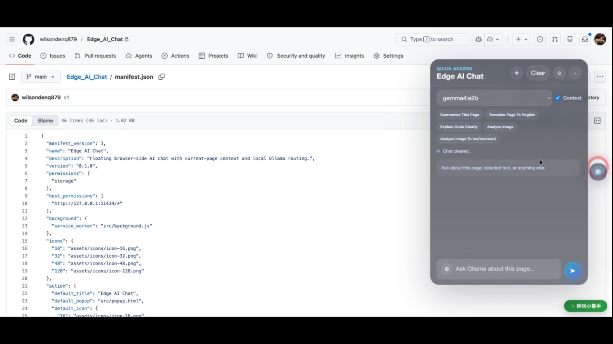
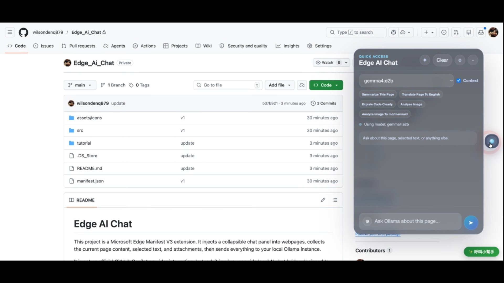
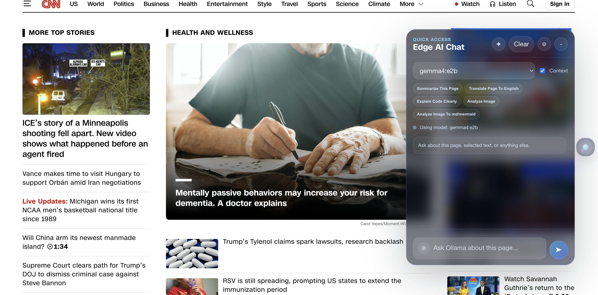
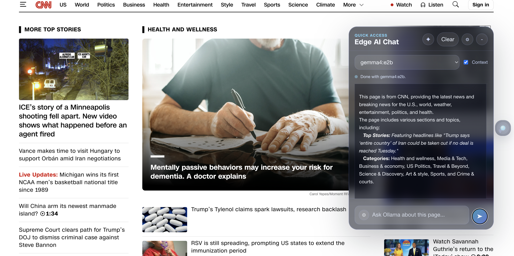
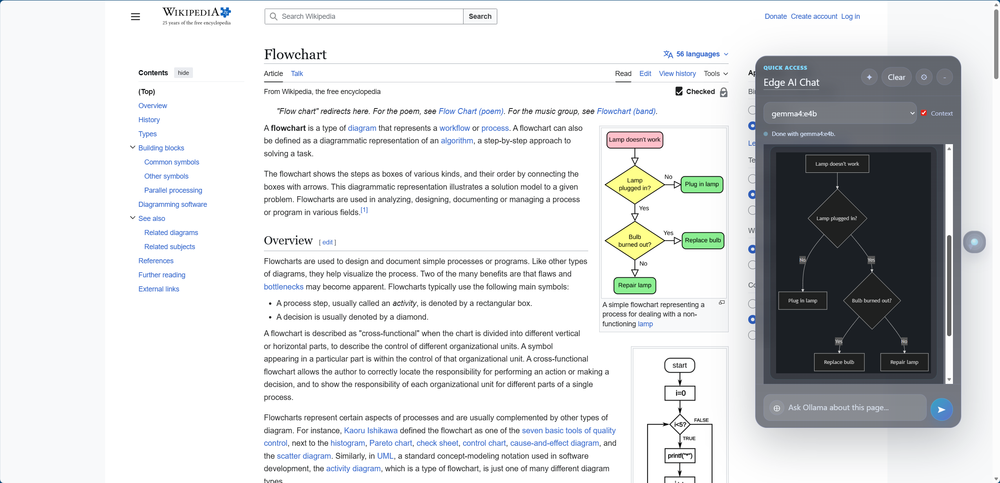

# Open Copilot

Open Copilot is a Microsoft Edge Manifest V3 extension that adds a floating AI chat panel to normal webpages and routes requests to your local or configured AI providers.

這是一個 Microsoft Edge Manifest V3 擴充套件，會在一般網頁右下角加入可收合的 AI 聊天面板，並把請求送到你本機或已設定的 AI provider。

One of its most useful ideas is that you can create your own reusable skills / starters for recurring tasks, then share them with other people as prompt workflows they can import and use.

它其中一個很實用的重點，是你可以把常做的任務整理成自己的 reusable skills / starters，之後再分享給別人，讓他們也能直接匯入同樣的 prompt workflow。

Starters are a core part of the product, not a side feature. Depending on the site and page type you are viewing, the extension can surface the most relevant starters first so people can start from a useful workflow instead of inventing prompts from scratch.

Starter 是這個產品的核心，不是附屬功能。根據你正在看的網站與頁面類型，extension 會優先浮出最相關的 starters，讓使用者不用從零自己想 prompt，就能直接從合適的 workflow 開始。

It is especially useful in environments where people want a practical AI tool without asking for admin-level backend access. Because it can run with local models and a shared work folder setup, teams can use it in a local-first way and keep sensitive working material inside their own controlled environment.

它特別適合那種想要有實用 AI 工具、但又不想申請 admin 級後台權限的環境。因為它可以搭配地端模型與共用 work folder 來運作，團隊能在本地優先的方式下使用，同時把敏感工作資料留在自己可控的環境裡。

## Screenshots | 畫面預覽 

*Code helper / 程式碼輔助*


*Web summarizer / 網頁摘要*


*Page summary / 頁面摘要*


*Chat panel / 聊天面板*


*Flow chart to Mermaid / 流程圖轉 Mermaid*


---

## English

### What This Project Is

Open Copilot is a browser-side AI bridge for Microsoft Edge.

Instead of replacing your browser workflow, it adds a floating chat panel directly into webpages so you can ask questions about the page you are already reading, attach supporting material, and send everything to your own AI stack.

It is not an official GitHub Copilot provider integration, and it is not a hosted cloud chat product.

### What It Can Do

- Inject a floating chat panel into standard `http://` and `https://` pages
- Use the current page as prompt context
- Pull in selected text from the page
- Stream assistant responses
- Accept image and text-file attachments
- Render Mermaid code blocks as diagrams
- Offer built-in starter prompts / starter skills
- Surface the most relevant starters based on the current site and page type
- Switch reply language
- Let you choose the active model from the popup
- Save system prompts and multi-perspective profiles
- Create, import, and manage custom starters / reusable skills
- Share starter definitions with teammates or friends so they can reuse the same workflows
- Pull GitHub content into the workflow
- Include many GitHub-focused skills for review, cross-checking, spec coverage, drift detection, and repo analysis
- Expand into a workspace-style view that feels closer to a lightweight IDE than a tiny chat widget
- Connect to a local work folder
- Sync saved data through Google Drive app data
- Extract task reminders from recent chat activity
- Pull follow-ups, action items, and reminder candidates out of the current conversation

### Provider and Configuration Status

The settings page currently stores connection details for:

- Ollama
- LM Studio
- Gemini
- Azure OpenAI

Default values:

- Ollama URL: `http://127.0.0.1:11434`
- LM Studio URL: `http://127.0.0.1:1234`
- Gemini model: `gemini-2.5-flash`
- Azure OpenAI API version: `2024-10-21`
- Default provider: `ollama`

Today, the most complete in-page chat path is the local-model workflow centered on the selected model. LM Studio and the hosted-provider settings are already present in the UI and storage model to support broader routing over time.

Another major part of the project is skill-building: you can turn a good prompt pattern into a reusable starter, keep it in your own library, and pass that JSON to someone else so they can run the same workflow in their browser.

The starter system is also designed to reduce prompt friction. Instead of asking users to guess what to type, the extension can adapt the visible starter set to the current website context, which makes the product much easier to use for non-technical users.

GitHub is also a major focus. The extension already includes many GitHub-oriented skills / starters, so repository review, document cross-checking, requirement mapping, test-gap spotting, and similar workflows are first-class use cases rather than afterthoughts.

That same local-first setup can also work well for teams. If everyone points the extension at local models and uses a shared work folder, they can reuse the same exported conversations, documents, and starter workflows while keeping sensitive content off a public SaaS path.

### Good Use Cases

- Summarize articles, docs, and long webpages
- Translate the current page
- Explain code snippets or technical content
- Analyze screenshots, diagrams, and design drafts
- Turn content into Markdown or Mermaid
- Review GitHub-related material with page-aware context
- Pull action items out of page content and chat history
- Capture follow-up tasks from chat sessions so you can turn discussions into reminders
- Build your own skill library for repeated research, review, writing, or analysis tasks
- Share working starter recipes with a team so everyone can use the same AI workflow
- Give non-coders and non-prompt-engineers an easier workspace with visible tools, starter actions, and task panels instead of a blank prompt box

### Installation

#### 1. Clone the repository

```bash
git clone https://github.com/<your-account>/Open_Copilot.git
cd Open_Copilot
```

#### 2. Load it in Microsoft Edge

1. Open `edge://extensions`
2. Enable `Developer mode`
3. Click `Load unpacked`
4. Choose the checked-in `dist/` folder from this repository

The repository already includes `dist/`, so a normal install does not require a build step.

### Prerequisites

You need at least one working AI backend.

If you want remote access to your home or office AI backend, a practical approach is to connect through a WireGuard VPN instead of exposing the service directly to the public internet. A setup worth considering is running a WireGuard VPN server on an ASUS router, then reaching your local Ollama or other backend through that private tunnel.

#### Ollama

Start the service:

```bash
ollama serve
```

List installed models:

```bash
ollama list
```

Pull a model if needed:

```bash
ollama pull gemma4:e2b
```

For Ollama context size, my own practical baseline on an `M4 Mac mini 16GB RAM` is around `16K ~ 32K`. That is generally smooth enough for everyday use. Other setups will depend on your hardware, but I recommend starting with a smaller context first and increasing it gradually.

#### LM Studio

1. Start the local server in LM Studio
2. Enable the OpenAI-compatible endpoint
3. Confirm the URL, usually `http://127.0.0.1:1234`
4. Load at least one model

For image analysis, choose a vision-capable model. Models with names like `vision`, `vl`, `llava`, or `qwen-vl` are common examples, and `gemma4` can also handle image analysis.

### How To Use It

#### Popup

From the extension popup you can:

- See the current endpoint
- Open the settings page
- Refresh the model list
- Click a model card to set the active model

#### Settings

The settings page currently covers:

- Ollama URL
- LM Studio URL / Model ID / API Key
- Gemini Model / API Key
- Azure OpenAI Endpoint / Deployment / API Version / API Key
- GitHub API Key
- Default Provider
- Reply Language
- Task extraction window
- Local Work Folder
- Google Drive Sync
- System Prompt
- Multi-Perspective Profiles
- Custom Starters

Custom starters are especially important here: they let you package a prompt, output style, and usage scope into something reusable instead of rewriting the same instructions every time.

The extension also supports task extraction. It can scan recent visible chat content, pull out likely to-dos or follow-ups, and keep them as reminder candidates with a configurable extraction window.

The `Local Work Folder` setting is also important. Once you pick a work folder in Settings, conversation exports such as `Download MD` save into that folder, and the same folder can be used as the source for local documents plus pull / push sync actions.

If you work with GitHub often, the `GitHub API Key` setting matters too. Adding a GitHub personal access token lets the extension fetch GitHub content you are allowed to access, including private repositories, so the GitHub-focused skills can work with much richer source material.

This setup is also useful for privacy-sensitive team workflows: instead of depending on a centrally managed cloud workspace, a team can keep using local models and a shared work folder to collaborate around documents and exports while preserving tighter control over sensitive material.

#### Floating Chat Panel

On normal webpages, a launcher appears at the bottom-right corner. Inside the panel you can use:

- A model switcher
- The `Context` toggle
- Starter buttons
- A maximized view that expands into a fuller workspace / IDE-like mode
- Task scanning to pull task / reminder candidates from the current visible content and conversation
- `✦` to insert highlighted text
- `⊕` to attach images or text files
- `Clear` to reset the current chat
- `Ctrl/Cmd + Enter` to send
- `Ctrl/Cmd + /` to open or collapse the panel

If you have already configured a `Local Work Folder`, using `Download MD` during a conversation saves the exported chat Markdown into that folder instead of treating export as a separate manual setup.

The maximized view is especially important. Once expanded, the panel behaves more like a lightweight IDE or copilot workspace: you get a larger working area, visible starter tools, task inbox panels, attached sources, and model controls all in one place. That makes it much easier for people who do not write code and do not know how to craft prompts from scratch.

Because the visible starters are context-aware, this workspace-style view often feels like opening a task-focused assistant for the site you are already on rather than a generic chatbot.

### What Page Data Gets Included

When `Context` is enabled, the extension may include:

- Page title
- Page URL
- Meta description
- `h1` / `h2` / `h3` content
- Current text selection
- Part of the visible page text
- Recent conversation history

When `Context` is disabled, that page context is not automatically attached.

### Attachment Support

#### Images

You can attach images by:

- Choosing files with `⊕`
- Dragging and dropping them into the panel
- Pasting images from the clipboard

#### Text files

Supported formats:

- `.txt`
- `.md`
- `.markdown`
- `.json`
- `.csv`

### Built-In Starter Directions

The repo includes many starter flows, including:

- Page summarization
- Page translation
- Code explanation
- Image analysis
- Image to Markdown / Mermaid
- GitHub review and specification checks
- Multi-perspective synthesis

GitHub-oriented starters are one of the strongest parts of this project. They cover workflows such as:

- repository purpose and architecture mapping
- review focus and regression hotspot checks
- spec coverage and implementation drift checks
- document review and requirement mapping
- security review, config review, and permission review
- test-gap analysis

You can also create your own starter library. In practice, that means:

- designing a repeatable prompt workflow once
- saving it as a custom starter / skill
- updating it over time by ID
- sharing the JSON with other users so they can import the same workflow

And this does not mean everyone has to write a starter from scratch. I already designed a `Create own starter` template flow, so users can simply fill in the form and go from there.

The `Create own starter` flow can be very simple:

1. Fill in the starter name.
2. Describe what you want it to do.
3. Choose the page types it should work on, such as `github`, `document`, `code`, or `article`.
4. Describe the output format and style you want.
5. Send it to AI so it can turn that input into a fuller starter workflow.
6. Save it into your starter library, then keep improving it later with the same `id`.

So the practical flow is not "everyone must know starter JSON or prompt engineering." A more realistic path is to use the built-in starter template, explain the intent clearly, and let AI help generate a reusable starter.

If you build a good one, please share it in GitHub Discussions. A big part of the project is letting people trade useful skills, compare prompt workflows, and build a stronger shared library together.

Here are a few starter examples you can paste into Settings:

```json
[
  {
    "id": "github-pr-review",
    "label": "GitHub PR Review",
    "prompt": "Review the current GitHub page like a careful reviewer. Focus on likely regressions, missing tests, contract drift, and any unclear requirements. Respond with findings first, ordered by severity.",
    "scopes": ["github", "code"],
    "mode": "chat"
  },
  {
    "id": "doc-to-tasks",
    "label": "Doc To Tasks",
    "prompt": "Read the current page and turn it into a short action list. Extract concrete tasks, owners if mentioned, deadlines if mentioned, and open questions. Use concise bullets.",
    "scopes": ["article", "document", "generic"],
    "mode": "chat"
  },
  {
    "id": "multi-view-decision",
    "label": "Multi-View Decision",
    "prompt": "Analyze the current topic from multiple perspectives, then end with one practical recommendation and the main risk to watch.",
    "scopes": ["generic", "market", "github"],
    "mode": "perspective"
  }
]
```

### Privacy and Data Flow

This project is local-first, but not every workflow stays fully local.

Important notes:

- Ollama and LM Studio requests go to the endpoints you configure
- Gemini and Azure OpenAI credentials can be stored in extension storage
- A GitHub token allows the extension to fetch GitHub content you can access
- Google Drive sync writes sync data into your Google Drive app data
- Mermaid rendering currently depends on `https://mermaid.ink`

If you plan to use the extension with sensitive material, review the current request paths and storage behavior first.

That said, one of the main advantages here is that the core workflow does not require admin-level platform access to be useful. With local models and an agreed shared work folder, teams can still adopt it for local collaboration while keeping sensitive data handling closer to their own machines and network boundaries.

### Current Limitations

- This is not an official GitHub Copilot provider integration
- Multi-provider routing is still evolving
- Image support depends on the selected model's vision capability
- Page context is summarized and clipped, not a full raw-page dump
- Content quality varies by site structure, iframe boundaries, and CSP behavior

### Project Structure

```text
.
├─ manifest.json
├─ src/
│  ├─ background.js
│  ├─ content-script.js
│  ├─ popup.html / popup.js
│  ├─ options.html / options.js
│  ├─ ui.css
│  └─ injected.css
├─ assets/
├─ scripts/
│  └─ build-dist.mjs
└─ dist/  (generated after build)
```

### Rebuild After Changes

After editing the source, rebuild `dist/`:

```bash
node scripts/build-dist.mjs
```

Then refresh the extension once in `edge://extensions`.

---

## 中文說明

### 這個專案是什麼

Open Copilot 的核心目標，是把「任何網頁上的閱讀、整理、提問、翻譯、分析」接到你自己的 AI 工作流裡。

它不是官方的 GitHub Copilot provider 整合，也不是雲端代管聊天服務；它比較像是一個瀏覽器側的 AI bridge：

- 在網頁中直接開聊天面板
- 自動帶入目前頁面脈絡
- 可加入選取文字、圖片、文字檔、GitHub 檔案、本機文件、其他瀏覽器分頁
- 將請求送往 Ollama、LM Studio，並預先保存 Gemini / Azure OpenAI 等設定

### 目前支援的能力

- 在一般 `http://` / `https://` 頁面注入右下角浮動聊天面板
- 使用目前頁面的標題、URL、meta description、標題層級與部分可見文字作為 prompt context
- 把目前反白文字一鍵帶入輸入框
- 支援串流回覆
- 支援圖片附件與文字檔附件
- 可渲染模型輸出的 Mermaid 圖表
- 內建多組 starter prompts / starter skills
- 會依目前網站與頁面類型，優先顯示最相關的 starters
- 可切換回覆語言
- 可在 popup 中快速查看與切換模型
- 可在 settings 中設定多個 provider
- 可保存 system prompt 與 multi-perspective profiles
- 可建立、匯入、管理 custom starters / reusable skills
- 可把自己整理好的 starter 分享給其他人重複使用
- 可從 GitHub 讀取內容作為分析材料
- 內建很多針對 GitHub 的 skill，可用於 review、交叉比對、spec coverage、drift check 與 repo 分析
- 可放大成接近輕量 IDE 的工作模式，而不只是小型聊天框
- 可連結本機工作資料夾，推拉聊天與文件資料
- 可用 Google Drive app data 做同步
- 可從聊天內容抽取 task reminders
- 可從目前對話中抓出 follow-up、action items 與提醒候選項目

### Provider 與設定現況

目前設定頁已支援保存以下 provider 或相關連線資訊：

- Ollama
- LM Studio
- Gemini
- Azure OpenAI

預設值：

- Ollama URL: `http://127.0.0.1:11434`
- LM Studio URL: `http://127.0.0.1:1234`
- Gemini model: `gemini-2.5-flash`
- Azure OpenAI API version: `2024-10-21`
- Default provider: `ollama`

實際的本地聊天主流程目前以 Ollama / 已選模型為主；LM Studio 與其他 provider 的設定已在介面與儲存層準備好，方便後續擴充與多路由使用。

另外，這個專案很重要的一塊就是 skill-building。你可以把一套好用的 prompt 流程整理成自己的 starter，收進技能庫，之後直接把 JSON 分享給別人，讓對方也能在自己的瀏覽器中匯入同樣 workflow。

而且 starter 系統本身就是為了降低 prompt 門檻而設計的。使用者不需要先猜該怎麼下指令；extension 會根據目前網站脈絡，優先顯示更相關的 starter，對非技術使用者會友善很多。

另外，GitHub 也是這個專案特別著墨的重點。extension 內建了不少偏向 GitHub 使用情境的 skills / starters，所以像 repository review、文件交叉比對、需求對照、測試缺口檢查這些，不是附帶用途，而是很核心的使用方向。

同樣地，這種本地優先的配置也很適合團隊。只要大家都把 extension 指向地端模型，再搭配同一個共用 work folder，就能共用匯出的對談、文件與 starter workflow，同時避免把敏感內容丟到公開 SaaS 路徑上。

### 適合的使用情境

- 摘要網頁、新聞、文件
- 翻譯目前頁面
- 解釋頁面中的程式碼或技術內容
- 分析設計稿、截圖、圖表
- 根據目前內容產生 Markdown / Mermaid
- 針對 GitHub repository、檔案、頁面內容做整理或 review
- 從對話與頁面內容中抽出待辦事項
- 把聊天過程中提到的 follow-up 與待辦抓成提醒候選
- 建立自己的 skill library，整理常用的研究、寫作、review、分析流程
- 把已驗證有效的 starters 分享給團隊或朋友一起使用
- 讓不會寫 code、也不熟 prompt 的人，直接在可視化工作台中操作，而不是面對空白輸入框

### 安裝方式

#### 1. 下載專案

```bash
git clone https://github.com/<your-account>/Open_Copilot.git
cd Open_Copilot
```

#### 2. 載入到 Microsoft Edge

1. 開啟 `edge://extensions`
2. 打開 `Developer mode`
3. 點選 `Load unpacked`
4. 選擇這個 repository 內已經附上的 `dist/` 資料夾

因為這個 repository 會直接附上 `dist/`，一般安裝情境下不需要先 build。

### 先決條件

至少需要一個可用的 AI backend。

如果你想從外部網路遠端存取家中或辦公室的 AI backend，實務上比較建議透過 WireGuard VPN 連回去，而不是直接把服務暴露到公網。比較推薦的做法，是搭配華碩路由器上的 WireGuard VPN Server 來建立連線，再經由這條私有通道存取本機的 Ollama 或其他 backend。

#### 使用 Ollama

啟動服務：

```bash
ollama serve
```

查看已安裝模型：

```bash
ollama list
```

尚未安裝模型時，可先拉一個：

```bash
ollama pull gemma4:e2b
```

關於 Ollama 的 context 設定，我自己的實際使用經驗是：`M4 Mac mini 16GB RAM` 大約設在 `16K ~ 32K`，基本上可以順起來、用起來也算流暢。其他情況還是請依照你的硬體規格調整，但建議先從較小的 context 開始，再慢慢往上加，比較容易找到穩定又順手的設定。

#### 使用 LM Studio

1. 啟動 LM Studio 的本機伺服器
2. 確認 OpenAI-compatible API 已啟用
3. 預設 URL 通常為 `http://127.0.0.1:1234`
4. 載入至少一個模型

若要做圖片分析，請使用 vision-capable model。常見例子是名稱中含有 `vision`、`vl`、`llava`、`qwen-vl` 的模型，而 `gemma4` 也可以做圖片分析。

### 使用方式

#### Popup

點擊瀏覽器工具列中的擴充套件圖示後，你可以：

- 查看目前 endpoint
- 進入設定頁
- 重新抓取模型清單
- 點選模型卡快速切換目前模型

#### Settings

設定頁目前可調整或保存：

- Ollama URL
- LM Studio URL / Model ID / API Key
- Gemini Model / API Key
- Azure OpenAI Endpoint / Deployment / API Version / API Key
- GitHub API Key
- Default Provider
- Reply Language
- Task extraction window
- Local Work Folder
- Google Drive Sync
- System Prompt
- Multi-Perspective Profiles
- Custom Starters

其中 custom starters 是這個專案很值得用的一塊。你可以把 prompt、輸出格式、使用範圍包成一個可重複使用的 skill，而不是每次都重打一遍。

另外，extension 也支援待辦抓取。它可以掃描最近可見的聊天內容，整理出可能的 to-dos、follow-up 與提醒候選，並搭配可調整的抓取時間範圍來使用。

`Local Work Folder` 也很重要。你先在 Settings 裡指定好 work folder 之後，對談中的 `Download MD` 這類匯出就會直接存到那個資料夾，同時那個資料夾也能拿來當本機文件來源，以及做 pull / push 同步。

如果你常用 GitHub，那 `GitHub API Key` 也很值得設定。填入 GitHub personal access token 之後，extension 就能抓取你有權限存取的 GitHub 內容，包含 private repositories，這樣那些 GitHub 導向的 skills 才能吃到更完整的材料。

這種配置對重視資料機敏性的團隊也很有幫助。你不一定需要倚賴集中式雲端工作區或申請 admin 權限；只要使用地端模型，再配合共用的 work folder，就能在團隊內共享文件與匯出結果，同時把敏感資料維持在自己可控的設備與網路範圍裡。

#### 網頁右下角聊天面板

進入一般網頁後，右下角會出現聊天按鈕。打開面板後可使用：

- 模型切換下拉選單
- `Context` 開關
- starter buttons
- 最大化檢視，展開成更完整的 workspace / IDE-like 工作模式
- 掃描代辦，從目前可見內容與對談中整理 task / reminder candidates
- `✦` 把目前反白文字帶入輸入框
- `⊕` 加入圖片或文字檔附件
- `Clear` 清除目前聊天與附件
- `Ctrl/Cmd + Enter` 送出訊息
- `Ctrl/Cmd + /` 開啟或收合面板

如果你已經先設定好 `Local Work Folder`，那麼在對談中使用 `Download MD` 時，匯出的聊天 Markdown 會直接存進那個資料夾，不需要另外再找儲存位置。

其中放大模式特別重要。面板放大後，整體會更像一個輕量 IDE 或 copilot workspace：你會同時看到較大的工作區、starter 工具列、Task Inbox、加入的資料來源與模型控制。對不會寫 code、也不太會自己下 prompt 的人來說，這種操作方式比單純聊天框友善很多。

再加上 starter 會依網站情境做調整，整個放大模式用起來更像是「針對這個網站特別準備好的任務工作台」，而不是一個通用聊天機器人。

### 送給模型的頁面內容

當 `Context` 開啟時，系統會盡量整理以下內容進 prompt：

- 頁面標題
- 頁面 URL
- meta description
- `h1` / `h2` / `h3`
- 使用者目前反白的文字
- 部分可見頁面文字
- 最近對話內容

關閉 `Context` 後，這些頁面脈絡就不會自動附加。

### 附件支援

#### 圖片

可透過以下方式加入：

- 點 `⊕` 選檔
- 直接拖拉進聊天面板
- 從剪貼簿貼上圖片

#### 文字檔

目前支援：

- `.txt`
- `.md`
- `.markdown`
- `.json`
- `.csv`

### 內建 starters 範例

repo 內建許多 starter 與描述，常見方向包含：

- 頁面摘要
- 頁面翻譯
- 技術內容解說
- 圖片分析
- 圖片轉 Markdown / Mermaid
- GitHub review / spec coverage / drift check
- 多視角整理

其中 GitHub 導向的 starters 是這個專案很重要的一塊，涵蓋像是：

- repository purpose 與 architecture mapping
- review focus 與 regression hotspot 檢查
- spec coverage 與 implementation drift check
- 文件 review 與 requirement mapping
- security review、config review、permission review
- test-gap analysis

你也可以建立自己的 starter library。實際上就是：

- 先把一套常用 prompt workflow 設計好
- 存成 custom starter / skill
- 之後用相同 `id` 持續更新
- 再把那份 JSON 分享給其他使用者匯入

而且這件事不需要大家從零自己手寫。因為我已經把 `Create own starter` 的樣板流程設計好了，使用者只要把表單填一填即可。

`Create own starter` 的實際方式可以很簡單：

1. 在樣板裡填入這個 starter 的名稱。
2. 寫清楚你想拿它來做什麼。
3. 勾選適合使用的頁面類型，例如 `github`、`document`、`code`、`article`。
4. 補上你希望最後產出的形式與風格。
5. 送給 AI，讓它幫你整理成完整的 starter workflow。
6. 存進自己的 starter library，之後再用同一個 `id` 持續更新。

所以比較貼近實際的流程，不是每個人都要自己懂 starter JSON 或 prompt engineering，而是先透過這個已經設計好的 starter 樣板，把需求講清楚，再交給 AI 幫你生成可重複使用的 starter。

如果你做出不錯的 skill，也很歡迎分享到 GitHub Discussions。這個專案很重要的一部分，就是讓大家可以互相交流好用的 skills、比較 prompt workflow，慢慢把共享的技能庫一起做大。

下面是幾組可以直接貼進 Settings 的 starter 範例：

```json
[
  {
    "id": "github-pr-review",
    "label": "GitHub PR Review",
    "prompt": "請用嚴謹 reviewer 的角度檢查目前 GitHub 頁面。優先找出可能的回歸風險、缺少的測試、契約不一致，以及需求不清楚的地方。請先列 findings，並依嚴重程度排序。",
    "scopes": ["github", "code"],
    "mode": "chat"
  },
  {
    "id": "doc-to-tasks",
    "label": "Doc To Tasks",
    "prompt": "請閱讀目前頁面內容，整理成一份短的 action list。抓出具體待辦、若有提到就標出負責人、截止時間，以及仍待確認的問題。請用精簡條列。",
    "scopes": ["article", "document", "generic"],
    "mode": "chat"
  },
  {
    "id": "multi-view-decision",
    "label": "Multi-View Decision",
    "prompt": "請從多個不同角度分析目前主題，最後收斂成一個最務實的建議，以及一個最需要注意的風險。",
    "scopes": ["generic", "market", "github"],
    "mode": "perspective"
  }
]
```

### 隱私與資料流向

這個專案的主要定位是本機優先，但不是所有資料都永遠只留在本機。

請特別注意：

- 若你使用 Ollama / LM Studio，本體聊天請求會送到你設定的本機服務
- 若你填入 Gemini / Azure OpenAI，相關設定會儲存在 extension storage 中
- 若你填入 GitHub API Key，extension 可以用它讀取你有權限的 GitHub 內容
- 若啟用 Google Drive Sync，聊天文件與同步資料會寫入你的 Google Drive app data
- Mermaid 圖表轉 SVG 目前依賴外部服務 `https://mermaid.ink`

如果你要拿這個 extension 處理敏感資料，建議先自行檢查目前的資料流設計與對外請求行為。

即使如此，這個工具的一個主要優勢還是：它在核心使用情境上，不需要先取得 admin 級平台權限才有價值。若搭配地端模型與共用 work folder，團隊仍然可以在本地協作，同時把機敏資料盡量留在自己的設備與網路邊界內。

### 已知限制

- 這不是官方 GitHub Copilot provider 整合
- provider 多路由體驗仍在擴充中，目前主聊天流程最明確的是本地模型路線
- 圖片分析能力取決於你選用的模型是否支援 vision
- 網頁 context 會做截斷與整理，不保證完整覆蓋超長頁面
- 某些網站因 CSP、iframe、動態 DOM 結構不同，實際抓到的內容品質會有差異

### 專案結構

```text
.
├─ manifest.json
├─ src/
│  ├─ background.js
│  ├─ content-script.js
│  ├─ popup.html / popup.js
│  ├─ options.html / options.js
│  ├─ ui.css
│  └─ injected.css
├─ assets/
├─ scripts/
│  └─ build-dist.mjs
└─ dist/  (build 後產生)
```

### 開發與重新打包

修改完原始碼後，重新生成 `dist/`：

```bash
node scripts/build-dist.mjs
```

然後回到 `edge://extensions` 按一次重新整理即可的喔。
