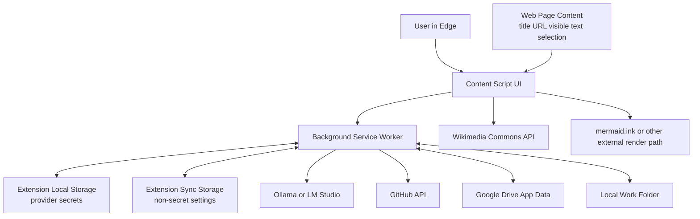

# Security Policy

## Overview

Open Copilot is a Microsoft Edge Manifest V3 extension that can:

- read page context from normal `http://` and `https://` pages
- send prompts and attachments to a selected AI backend
- access GitHub content when a GitHub token is configured
- write exported data to a user-selected local work folder
- sync selected data through Google Drive app data

This project is local-first, but it is not fully offline and it should not be treated as a hardened environment for highly regulated or highly confidential workloads without an additional security review by the user or organization deploying it.

## Security Goals

The project aims to:

- keep provider secrets out of normal webpage contexts
- limit sensitive operations to extension-controlled code paths
- make data flow visible enough for users to evaluate risk before use
- reduce avoidable over-permissioning, especially for GitHub access

The project does not claim:

- end-to-end encryption across every feature path
- suitability for classified, regulated, or zero-trust environments by default
- protection against every risk introduced by third-party model providers or external services chosen by the user

## Implemented Security Protections

The current codebase includes the following protections:

- Local secret storage: `githubApiKey`, `geminiApiKey`, and `azureOpenAiApiKey` are stored in extension-local storage rather than sync storage.
- Secret migration: if older versions stored those secrets in sync storage, they are migrated into local storage and removed from sync storage.
- Config redaction for webpage contexts: normal webpage content scripts do not receive provider secrets as part of configuration responses.
- Background-controlled secret use: secret-backed actions are handled by extension-controlled background flows instead of being exposed directly to page scripts.
- Cross-frame message hardening: frame-context `postMessage` traffic is checked with nonce, source, and origin validation before it is accepted.
- Prompt-injection mitigation: page content, attachments, GitHub context, browser-tab context, and recent chat history are wrapped and labeled as untrusted content before being sent to the model.
- GitHub token scope guidance: the UI and documentation recommend fine-grained, read-only GitHub tokens for GitHub-related features.

These protections reduce risk, but they do not eliminate all risk. Users should still review prompt contents, chosen model providers, sync targets, and browser-environment trust.

## Data Flow

### Notes on the diagram

- Provider secrets are intended to stay in extension-local storage and background-controlled flows.
- General settings such as model selection, language, and non-secret preferences may be stored in sync storage.
- Page content is assembled in the content script and then sent to the chosen model path when the user sends a request.
- GitHub access is optional and only used for GitHub-related workflows.
- Local Work Folder and Google Drive sync are optional.
- HTML export and diagram/image helper paths may involve external services depending on the feature being used.

## Sensitive Data Handling

### Provider secrets

The following values should be treated as secrets:

- `githubApiKey`
- `geminiApiKey`
- `azureOpenAiApiKey`

Current design intent:

- these secrets should remain in local extension storage
- secrets should not be returned to normal webpage content scripts
- secrets should only be used by extension-controlled message handlers and network requests

### GitHub token guidance

If you enable GitHub features:

- use a fine-grained token when possible
- prefer read-only repository access
- avoid broad classic PAT scopes unless you truly need them
- avoid using a token that can write code, manage org settings, or access unrelated repositories

### Page content and attachments

Users should assume that when they intentionally send a request, the following content may be included in the prompt and sent to the selected AI backend:

- page title
- page URL
- selected text
- visible page text
- attached text files
- attached images
- included GitHub file or repository context
- selected browser-tab context
- recent chat history included in the prompt

Important:

- If the selected AI backend is local, these contents are typically sent only to that local service endpoint.
- If the selected AI backend is external or hosted by a third party, these contents may leave the local device or local network and be transmitted to that external service.
- In other words, using an external AI backend can mean that page content, attachments, chat history, and added source context are sent outside your own machine or network boundary.
- Users should review the privacy, logging, retention, and training policies of any external AI backend before sending sensitive material.

If this is not acceptable for a given page, document, email, or repository, do not send that content through the extension.

## External Services and Trust Boundaries

Depending on configuration and feature use, this project may interact with:

- a local Ollama endpoint
- a local LM Studio endpoint
- the GitHub API
- Google Drive app data
- Wikimedia Commons search
- Mermaid rendering services or similar helper endpoints

Users are responsible for reviewing the privacy, logging, retention, and access policies of the services they choose to use with this extension.

## Secure Usage Recommendations

- Use local models for sensitive work whenever practical.
- Keep provider tokens scoped as narrowly as possible.
- Do not reuse a high-privilege GitHub token from unrelated workflows.
- Treat browser profiles that contain extension secrets as sensitive endpoints.
- Review local work folder contents before sharing or syncing them.
- Do not assume Google Drive sync is appropriate for confidential data just because it uses app data.
- Avoid using the extension on pages that contain secrets, regulated data, or internal-only material unless you have reviewed the exact request path you are enabling.

## Known Risk Areas

Areas that deserve continued scrutiny:

- page-context collection on dynamic web apps
- iframe and cross-context messaging boundaries
- secret handling across background and content-script boundaries
- external helper services used by rendering or asset lookup features
- local file export and sync behavior
- prompt construction that combines multiple attached sources

## Reporting a Vulnerability

Please do not post working exploits, private tokens, captured prompts, private repository contents, or sensitive screenshots in a public issue.

Preferred reporting order:

1. Use GitHub private vulnerability reporting or a repository security advisory flow if it is enabled.
2. If no private reporting channel is available, open a minimal public issue that states a security problem exists and asks for a private contact path.
3. Share the full reproduction details only after a private channel is available.

Please include:

- affected version, commit, or branch
- impact summary
- prerequisites
- reproduction steps
- expected behavior
- actual behavior
- whether the issue can expose secrets, page data, local files, GitHub content, or synced data

## Disclosure Expectations

Good-faith researchers are asked to:

- avoid unnecessary access to user data
- avoid modifying or deleting data
- stop once the issue is demonstrated
- give maintainers a reasonable chance to investigate and patch

Maintainers should prioritize issues involving:

- secret leakage
- unauthorized data access
- privilege-boundary failures
- arbitrary script execution
- unsafe cross-context messaging
- unintended sync or export of sensitive material

## Scope

This policy applies to the source in this repository. It does not guarantee the security posture of:

- forks with additional changes
- unofficial packaged builds
- third-party model providers
- browser extensions installed alongside this one
- enterprise deployment environments with their own policy or sync tooling

---

## 中文說明

### 概要

Open Copilot 是一個 Microsoft Edge Manifest V3 擴充套件，可能會：

- 讀取一般 `http://` 與 `https://` 網頁的頁面脈絡
- 將 prompt 與附件送到你選擇的 AI backend
- 在設定 GitHub token 後讀取 GitHub 內容
- 將匯出資料寫入使用者選擇的本機工作資料夾
- 透過 Google Drive app data 同步部分資料

這個專案是以本機優先為方向，但不是完全離線。若要拿來處理高度機密、受法規管制、或對隔離要求很高的資料，建議先由使用者或部署單位自行完成額外安全審查。

### 安全目標

本專案目前希望做到：

- 讓 provider secrets 不直接暴露在一般網頁環境
- 將敏感操作盡量限制在 extension 自己可控的程式路徑
- 讓資料流向足夠清楚，方便使用者自行判斷風險
- 降低不必要的過寬權限，特別是 GitHub token

本專案不聲稱：

- 每一條功能路徑都具備端到端加密
- 預設就適合分類資訊、受管制資料、或零信任環境
- 能完全涵蓋使用者自行選用的第三方模型服務或外部服務所帶來的所有風險

### 已實作的安全防護

目前程式碼已包含以下防護：

- Secret 改存本機：`githubApiKey`、`geminiApiKey`、`azureOpenAiApiKey` 會存放在 extension local storage，而不是 sync storage。
- 舊設定自動遷移：若舊版本曾把這些 secrets 存在 sync storage，系統會遷移到 local storage，並移除 sync storage 內的 secret 欄位。
- 一般網頁環境拿不到 provider secrets：普通網頁上的 content script 在讀取設定時，只會拿到已過濾的設定，不會直接收到 provider secrets。
- Secret 使用集中在 extension 控制流程：依賴 secret 的動作會由 background 控制的流程處理，不會直接暴露給頁面腳本。
- 跨 frame 訊息加固：frame context 的 `postMessage` 橋接現在會驗證 nonce、source 與 origin，才接受回傳內容。
- Prompt injection 緩解：頁面內容、附件、GitHub 脈絡、瀏覽器分頁脈絡、近期聊天內容，送給模型前都會被標示為 untrusted content，並用明確邊界包起來。
- GitHub token 權限建議：UI 與文件已明確建議使用 fine-grained、read-only 的 GitHub token。

這些措施是在降低風險，不代表能消除所有風險。使用者仍應自行檢查 prompt 內容、所選模型服務、同步目標，以及瀏覽器執行環境本身的可信度。

### 資料流

上面的 Mermaid 圖即為本專案目前的主要資料流。

補充說明：

- provider secrets 的設計目標是留在 extension local storage 與 background 控制的流程內
- 像模型選擇、語言、一般偏好等非秘密設定，可能會存放在 sync storage
- 頁面內容會先在 content script 組裝，再於使用者送出請求時送往選定的模型路徑
- GitHub 功能是選用功能，只在 GitHub 導向工作流中使用
- Local Work Folder 與 Google Drive sync 也都是選用功能
- HTML 匯出、圖片查詢、圖表渲染等功能，可能依實際使用情境接觸外部服務

### 敏感資料處理

#### Provider secrets

以下欄位應視為秘密資料：

- `githubApiKey`
- `geminiApiKey`
- `azureOpenAiApiKey`

目前的設計意圖：

- 這些 secrets 應留在 extension 的本機儲存空間
- 不應直接回傳給一般網頁上的 content script
- 應只由 extension 自己控制的 message handler 與 network request 使用

#### GitHub token 建議

若你要啟用 GitHub 相關功能：

- 優先使用 fine-grained token
- 優先使用唯讀 repository 權限
- 除非真的需要，否則不要使用 scope 很寬的 classic PAT
- 避免使用可寫入程式碼、管理組織設定、或存取無關 repository 的 token

#### 頁面內容與附件

使用者應假設：當你主動送出請求時，以下資料可能會離開目前頁面環境：

- 頁面標題
- 頁面 URL
- 選取文字
- 可見頁面文字
- 附加的文字檔
- 附加的圖片
- 加入的 GitHub 檔案或 repository 脈絡
- 選取加入的其他瀏覽器分頁脈絡
- 被包含進 prompt 的近期聊天內容

請特別注意：

- 如果你選用的是本機 AI backend，這些內容通常只會送到你設定的本機服務端點。
- 如果你選用的是外部或第三方代管的 AI backend，這些內容就可能離開你的裝置或本地網路，傳到外部服務。
- 在送出敏感資料前，請先自行確認該外部 AI backend 的隱私、記錄、保存期限與是否可能被用於模型訓練等政策。

如果某個頁面、文件、信件或 repository 的內容不適合外送，就不應透過 extension 將它送出。

### 外部服務與信任邊界

依照設定與功能使用情況，本專案可能會接觸：

- 本機 Ollama endpoint
- 本機 LM Studio endpoint
- GitHub API
- Google Drive app data
- Wikimedia Commons 搜尋
- Mermaid rendering service 或類似輔助端點

使用者需要自行評估這些外部服務的隱私、記錄、保留期限與權限政策是否符合自己的風險承受範圍。

### 安全使用建議

- 若要處理敏感資料，優先使用本機模型。
- provider token 權限應盡量縮小。
- 不要把高權限 GitHub token 拿來重複用在不相干的工作流。
- 把存放 extension secrets 的瀏覽器 profile 視為敏感端點。
- 分享或同步前，先檢查 Local Work Folder 內容。
- 不要因為 Google Drive sync 使用 app data 就直接假設它適合機密資料。
- 若頁面含有 secrets、受管制資料、或只限內部使用的內容，除非你已檢查清楚實際請求路徑，否則不要直接使用 extension 送出。

### 已知風險區域

以下區域仍值得持續檢查：

- 動態 web app 的頁面脈絡蒐集
- iframe 與跨 context 訊息邊界
- background 與 content script 之間的 secret 處理
- 圖表渲染或資產查詢使用到的外部輔助服務
- 本機檔案匯出與同步行為
- 將多種加入來源混進同一個 prompt 的組裝流程

### 漏洞回報

請不要在公開 issue 中直接貼出可用 exploit、私密 token、擷取到的 prompt、private repository 內容或敏感截圖。

建議回報順序：

1. 若 repository 已啟用 GitHub private vulnerability reporting 或 security advisory，優先使用該私密通道。
2. 若沒有私密回報管道，可先開一個最小化的公開 issue，僅說明存在安全問題並要求私下聯絡方式。
3. 在私密通道建立前，不要公開完整重現細節。

建議附上：

- 受影響版本、commit 或 branch
- 影響摘要
- 前置條件
- 重現步驟
- 預期行為
- 實際行為
- 該問題是否可能暴露 secrets、頁面資料、本機檔案、GitHub 內容或同步資料

### 披露期待

對善意研究者的期待：

- 避免不必要地接觸使用者資料
- 不要修改或刪除資料
- 在證明問題存在後就停止擴大操作
- 給維護者合理的調查與修補時間

維護者應優先處理：

- secret 洩漏
- 未授權資料存取
- 權限邊界失敗
- 任意腳本執行
- 不安全的跨 context 訊息
- 非預期的敏感資料同步或匯出

### 適用範圍

本政策適用於這個 repository 內的原始碼，不保證下列情況的安全性：

- 含額外修改的 fork
- 非官方封裝版本
- 第三方模型服務
- 與本 extension 一起安裝的其他瀏覽器 extension
- 具有額外企業政策、同步工具或管理機制的部署環境
