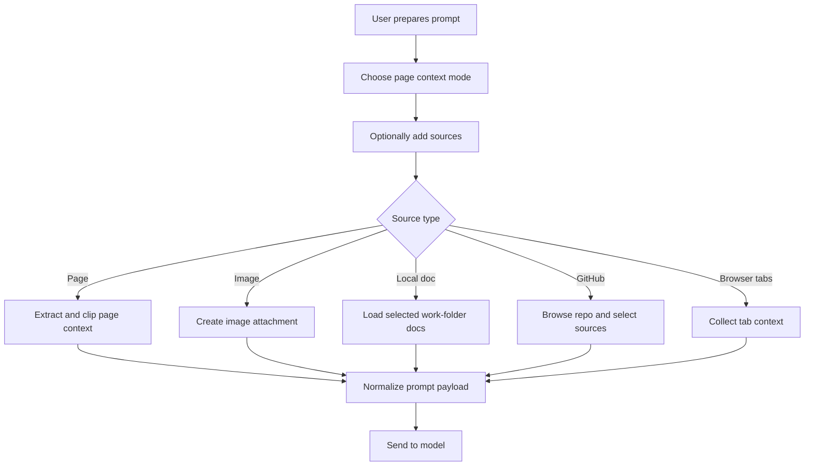

# Attachments and Context

## 功能目的

這個模組決定 Open Copilot 為什麼不是普通聊天框。它要把「目前頁面」和「額外資料來源」組成可控的 prompt context。

## 支援來源清單

- Current page context
- Current selection
- Dropped / pasted images
- Attached local documents
- Included GitHub repo / file sources
- Attached browser tabs

## 核心原則

- 不是所有內容都 raw dump 給模型
- 要有選擇、裁切、摘要、上限
- 使用者要清楚知道目前帶了哪些來源

## UI 結構契約

```text
Composer context ecosystem
|- Page context mode selector
|- Include panels
|  |- Browser tabs
|  |- Local documents
|  |- GitHub sources
|- Attachments strip
|  |- Image thumbnails
|  |- Document cards
|- Optional source pickers
```

## Context Mode 契約

- `auto`
  - 預設模式
  - 系統依頁面類型與需求決定加入多少 page context
- `always`
  - 強制加入頁面 context
- `never`
  - 不自動附加頁面 context

## 畫面上的使用者感知

使用者必須能從 UI 明確知道：

- 目前 model 是什麼
- context mode 是什麼
- 有沒有附加 browser tabs
- 有沒有附加 local docs
- 有沒有附加 GitHub sources
- 有沒有附圖或文件

## Dummy UI

```text
+----------------------------------------------------------------------------+
| Model [ qwen2.5-coder v ]                                                  |
| Current Page Context [ Auto v ]                                            |
|                                                                            |
| Browser Tabs                                                               |
| [Add Browser Tabs]                                                         |
| 2 tabs attached                                                            |
|                                                                            |
| Local Documents                                                            |
| [Add Local Document]                                                       |
| spec/api.md attached                                                       |
|                                                                            |
| GitHub Sources                                                             |
| [Include Repo or File]                                                     |
| openai/openai -> docs/api.md                                               |
|                                                                            |
| Attachments                                                                |
| [image thumbnail] [doc card: architecture.md]                              |
+----------------------------------------------------------------------------+
```

## Page Context 契約

系統應抽取而非整頁複製：

- page title
- URL
- meta description
- heading 結構
- 可見主要文字內容
- 某些網站專用 selector 的內容

### 特殊頁型處理

- GitHub：抓 diff/file/code context
- Email / Office：使用專用 selector
- iframe：透過訊息機制抓子 frame context，有限深度與 timeout

## Attachment 類型契約

### Image

- 來源可為 paste / drag-drop / file input
- UI 必須有 thumbnail
- 可單獨移除

### Local Document

- 從 local work folder 瀏覽選取
- 顯示文件名稱
- 可清除全部

### GitHub Source

- 先選 repo
- 再進檔案或目錄瀏覽
- 可選整 repo 或單檔
- 要有 summary 顯示目前已納入的 source
- 選擇器需具備 step-based flow：
  - repos
  - files
  - selected items confirmation

### Browser Tabs

- 開 picker
- 勾選 tab
- 讀取 tab context
- 顯示附加摘要

## Include Panel Visual Contract

- 每個 include panel 都是獨立的小卡片
- 上方是 trigger button
- 中間是 summary 文本
- 若已附加內容，右側要有清除按鈕

## Attachment Strip Visual Contract

- 圖片附件為 58x58 縮圖卡
- 文件附件為約 120x58 的橫向小卡
- 每個附件右上角都有小型移除按鈕

## 主要限制

- page text 長度上限
- image candidates 上限
- GitHub sources 上限
- attached documents 上限
- browser tabs 上限

這些上限不是 UI 細節，而是 prompt 控制契約。

## Flow Chart



## 狀態與資料

- `pageContextMode`
- `attachedImages[]`
- `attachedDocuments[]`
- `includedGithubSources[]`
- `attachedBrowserTabs[]`
- picker states:
  - `includePickerOpen`
  - `localDocumentPickerOpen`
  - `browserTabPickerOpen`

## Prompt Assembly Contract

最終送出的 prompt payload 必須能區分：

- system prompt
- user message
- page context
- GitHub included sources
- browser tab contexts
- local documents
- image attachments

不可把所有來源合併成一段無標記長文本。

## 驗收標準

- 使用者能明確看見所有已附加來源
- 每種來源都能被移除或清除
- GitHub / local docs / browser tabs 不可退化成隱藏背景資料
- context mode 切換後要有可見回饋
