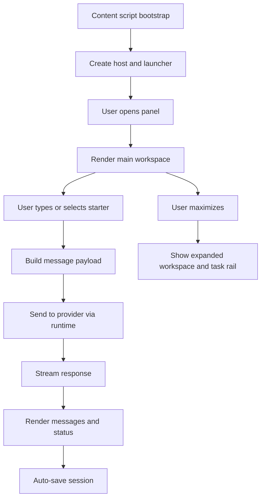

# In-Page Chat Panel

## 功能目的

這是 Open Copilot 最核心的體驗。它必須在一般 `http://` / `https://` 頁面中，以「右側浮動工作台」形式存在，而不是跳頁或全頁 app。

## 不可改變的產品特徵

- 右下角有發光 orb launcher
- 點 launcher 展開面板
- 面板是浮動、玻璃感、偏深色
- 面板能最大化成 workspace
- 最大化後仍屬於「嵌入頁面工具」，不是切換到另一個產品頁

## UI 結構契約

```text
Host
|- Shell
   |- Launcher button
   |- Panel
      |- Header
      |  |- Eyebrow + title
      |  |- Header action buttons
      |- Workspace
      |  |- Main pane
      |  |  |- Status
      |  |  |- Messages
      |  |  |- Compose area
      |  |- Optional task rail
      |  |- Sidebar
      |     |- Model select
      |     |- Context mode select
      |     |- Browser tabs include
      |     |- Local docs include
      |     |- GitHub include
      |     |- Starters panel
      |- Optional modals/pickers
```

## Header 功能契約

必須包含：

- Task inbox button
- Use selection
- Clear chat
- Maximize / restore
- Open settings
- Collapse panel

## Compose 區契約

- Dropzone
- 附件列
- 上傳按鈕
- 多行 textarea
- 送出按鈕

## Sidebar 契約

- Model select
- Page context mode select
- Browser tabs include panel
- Local document include panel
- GitHub include panel
- 模型下拉需支援 `Auto`；Auto 時允許 runtime routing，在 quick / reasoning / vision 之間切換，手動指定模型時則鎖定該模型
- `Auto` 的決策不可依賴特定模型家族命名；應優先依任務能力需求與使用者手動指定的角色模型決定
- Starters panel

## Dummy UI

```text
Closed

                              (glowing orb)

Open

+----------------------------------------------------------------------------------+
| QUICK ACCESS                               [☰] [✦] [trash] [□] [⚙] [-]         |
| Live Chat                                                                         |
|----------------------------------------------------------------------------------|
| Status: Ready                                                                     |
|----------------------------------------------------------------------------------|
| Messages                                                                          |
| User  請幫我檢查這個 GitHub PR 的風險                                              |
| AI    我先從變更面、測試缺口與可能回歸風險整理...                                  |
|----------------------------------------------------------------------------------|
| Attachments: [image] [doc.md]                                                     |
| [⊕] [ textarea...                                                     ] [➤]      |
|----------------------------------------------------------------------------------|
| Sidebar                                                                           |
| Model [ qwen2.5-coder v ]                                                         |
| Context [ Auto v ]                                                                |
| [Add Browser Tabs]                                                                |
| [Add Local Document]                                                              |
| [Include Repo or File]                                                            |
| Starter Tools                                                                     |
| [Page Summary] [GitHub Review] [Test Gap] [Create Starter]                        |
+----------------------------------------------------------------------------------+
```

## 最大化模式契約

- 面板加上 `is-maximized`
- 視覺上變成更完整 workspace
- 若頁面寬度足夠，task inbox 變成獨立右側 rail
- starters 區在最大化時預設展開

## 視覺規格

- host `z-index` 必須極高，避免被頁面蓋住
- 預設停靠右側
- launcher 約 46x46
- panel 預設寬度約 420px
- `max-height` 約 78vh
- 背景要有透明深色漸層 + 邊框 + blur

## Class-Level Layout Contract

- host: `#ollama-quick-chat-host`
- launcher: `.ollama-quick-launcher`
- panel: `.ollama-quick-panel`
- workspace: `.ollama-quick-workspace`
- main pane: `.ollama-quick-main-pane`
- sidebar: `.ollama-quick-sidebar`
- detached task rail: `.ollama-quick-task-rail`

這些 class 名稱不是單純 styling 細節，而是目前行為與佈局切換的重要節點。

## 互動規則

- launcher 可拖曳位置
- 面板開關不可造成整頁重新整理
- 點 maximize 切換工作模式
- 清除聊天會清空對話狀態
- use selection 會將目前文字選取納入 prompt

## 主要狀態

- `isPanelOpen`
- `isPanelMaximized`
- `launcherPosition`
- `chatMessages`
- `isGenerating`
- `composeMode`
- `pageContextMode`
- `currentPageCopilot`

## Header Action Mapping

- `☰`：task inbox
- `✦`：use current text selection
- trash icon：clear chat
- `□ / ❐`：maximize / restore
- `⚙`：open settings
- `-`：collapse panel

## Message Rendering Contract

- user message：
  - 靠右
  - 寬度上限約 88%
  - 藍紫漸層底
- assistant message：
  - 靠左或全寬
  - 深色半透明底
- markdown 要支援：
  - headings
  - lists
  - inline code / code block
  - Mermaid block 容器
  - links

## Flow Chart



## 驗收標準

- 關閉時只能看到 orb launcher
- 展開時同時看到聊天區與右側控制區
- 最大化後要明顯變成 workspace，不只是單純放大寬度
- 任何頁面上都要保持浮動工具感，不可像頁面原生區塊
