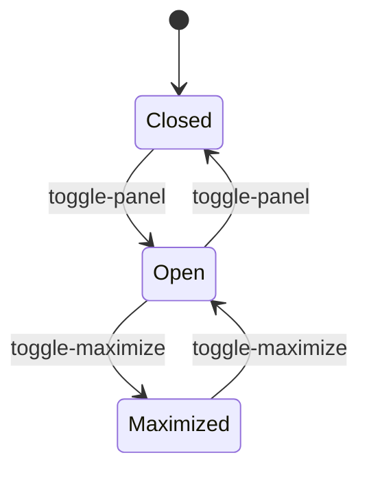
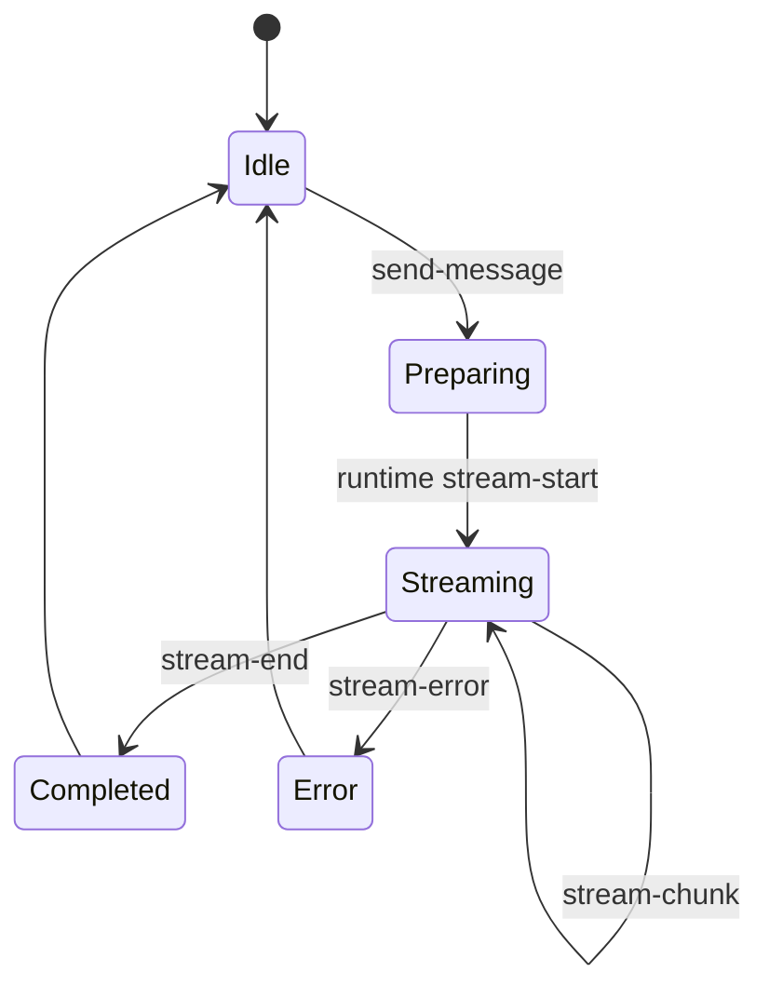
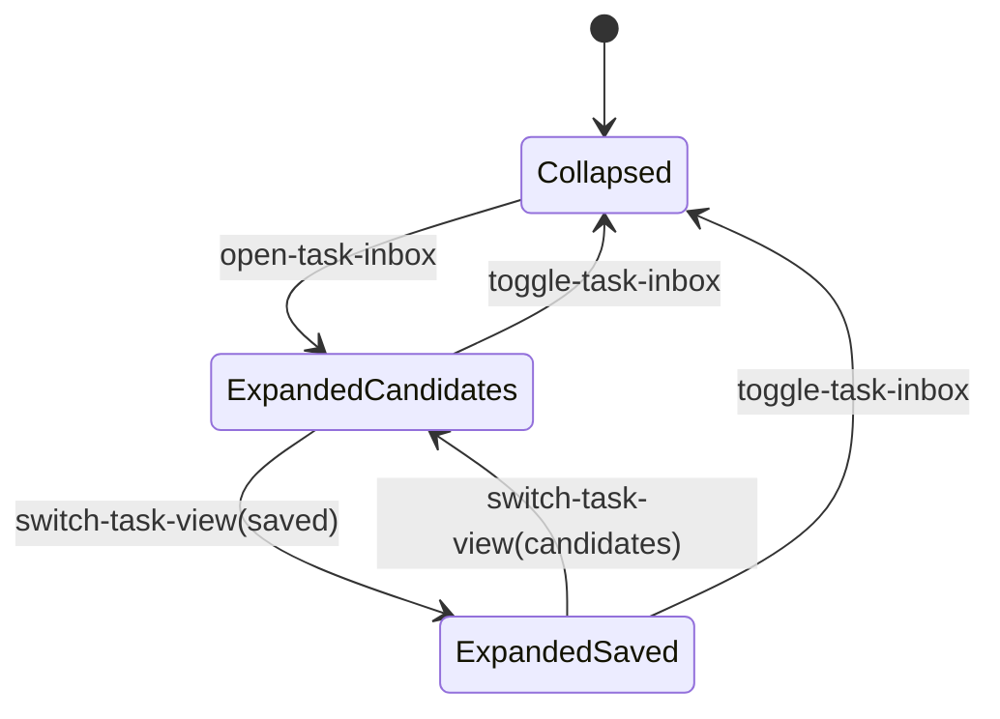

# Interaction and State Machine

## 目的

這份文件描述產品主要狀態與互動轉換。另一個 AI 若只重建畫面但沒有遵守這些狀態切換，使用手感就會和現有版本差很多。

## 主要狀態群組

### Panel Shell

- `isPanelOpen`
- `isPanelMaximized`
- `launcherPosition`
- `launcherDragState`
- `suppressLauncherToggle`

### Chat Runtime

- `chatMessages`
- `isGenerating`
- `activeStreamText`
- `activeStreamPort`
- `composeMode`

### Context and Sources

- `pageContextMode`
- `attachedImages`
- `attachedDocuments`
- `attachedBrowserTabs`
- `includedGithubSources`

### Pickers and Builders

- `includePickerOpen`
- `localDocumentPickerOpen`
- `browserTabPickerOpen`
- `customStarterBuilderOpen`
- `agentFlowBuilderOpen`

### Analysis and Tasks

- `latestPerspectiveRun`
- `extractedTaskCandidates`
- `savedTaskReminders`
- `isExtractingTasks`
- `taskInboxExpanded`
- `taskInboxView`

## Core Event Contract

### Shell Events

- `toggle-panel`
- `toggle-maximize`
- `open-settings`
- `clear-chat`
- `use-selection`

### Compose Events

- `send-message`
- file input `change`
- paste image
- drop file

### Context Events

- `page-context-mode` select change
- `open-browser-tab-picker`
- `open-local-document-picker`
- `open-include-picker`
- clear include buttons

### Starter Events

- `use-starter`
- `toggle-starters`
- `discuss-custom-starter`
- `create-custom-starter-skill`
- flow editor add/remove/move/save

### Task Events

- `extract-chat-tasks`
- `toggle-task-inbox`
- `switch-task-view`
- `save-task-candidate`
- `dismiss-task-candidate`
- `update-task-reminder`
- `toggle-task-complete`
- `delete-task-reminder`

## State Flow: Panel

## State Flow: Message Send

## State Flow: Task Inbox

## Launcher Drag Contract

- 點擊 orb 應切換 panel
- 拖曳超過 threshold 才進入 drag
- drag 完成後要保存 position
- 有移動時不可再觸發 toggle open/close

## Message Send Contract

1. 讀取 textarea 內容
2. 讀取選中的 starter mode
3. 組合 page context 與 attachments
4. push user message 進 `chatMessages`
5. 啟動串流
6. assistant draft 邊串流邊更新
7. 結束後寫回正式 assistant message
8. 保存 session

## Maximize Contract

- 只靠 class/state 切換，不重建不同產品頁
- maximized 時：
  - 面板寬度大幅增加
  - workspace gap 增加
  - starters 區展開
  - task rail 可獨立

## Rebuild Guardrails

- 不可把所有互動改成 React route 或全頁切換
- 不可把多個 picker 合併成單一模糊的「attach anything」視窗
- 不可把 state 簡化成只剩 `messages` 和 `open`
