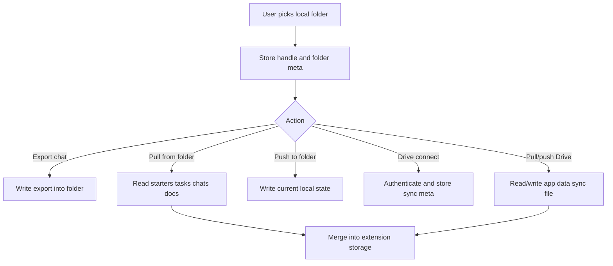

# Local Work Folder and Drive Sync

## 功能目的

這個模組支持 Open Copilot 的 local-first 協作定位。它不是附加備份功能，而是產品核心之一。

## 核心能力

- 設定 local work folder
- 將聊天匯出與資料同步到該 folder
- 從 folder pull/push starters、tasks、chat、documents
- 使用 Google Drive app data 作雲端同步

## 使用者心智模型

- Local work folder：我的本機或團隊共享工作資料夾
- Google Drive sync：背景同步層，不是普通檔案瀏覽器

## UI 契約

### Local Work Folder 區

- `Choose Folder`
- `Clear Folder`
- `Pull From Folder`
- `Push To Folder`
- status text
- configured folder label

### Google Drive Sync 區

- OAuth Client ID input
- enable sync checkbox
- auto-sync checkbox
- `Connect Google Drive`
- `Pull From Drive`
- `Push To Drive`
- `Disconnect`
- redirect URL
- sync status

## Dummy UI

```text
+--------------------------------------------------------------------------------+
| Local Work Folder                                                              |
| [Choose Folder] [Clear Folder] [Pull From Folder] [Push To Folder]            |
| Status: Local folder connected: Open_Copilot_Team                              |
| Configured Folder: browser exposes folder name only                            |
|                                                                                |
| Google Drive Sync                                                              |
| OAuth Client ID [ 123456.apps.googleusercontent.com ]                         |
| [x] Enable Drive sync                                                          |
| [x] Auto-sync after saves                                                      |
| [Connect Google Drive] [Pull From Drive] [Push To Drive] [Disconnect]         |
| Redirect URL: chrome-extension://...                                           |
| Last sync: 2026-04-11 14:20                                                    |
+--------------------------------------------------------------------------------+
```

## 同步資料契約

至少包含：

- starter skills
- agent flows
- task reminders
- chat sessions
- exported documents / sync documents

## 匯出契約

- 聊天匯出不應只下載到瀏覽器預設資料夾
- 若已設定 local work folder，應優先寫入該資料夾

## 合併策略契約

- pull 時要 merge，不是無條件覆蓋
- push 時要保留必要 metadata
- sync status 要可被 UI 顯示

## Flow Chart



## 狀態與資料

- `work-folder-handle`
- `localWorkFolderMeta`
- `googleDriveSyncMeta`
- `googleDriveSyncDocuments`
- sync timestamps / error messages

## 驗收標準

- settings 裡要看得見 local folder 與 Drive 兩塊完整操作區
- sync 狀態與錯誤要有明確文字回饋
- local-first 路徑不可被省略成單純瀏覽器下載
