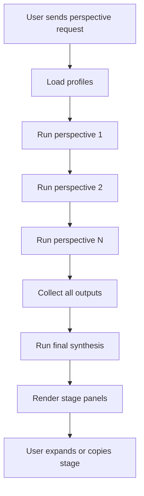

# Multi-Perspective Analysis

## 功能目的

將同一問題分別交給多個角色/視角分析，最後輸出整合結論。這使 Open Copilot 可以更像「多名審稿人協作」而非單一 chatbot。

## 核心契約

- 多視角不是單次 prompt 拼接，而是 staged execution
- 每個視角都要有獨立輸出
- 最後要有 synthesis
- 使用者可展開單一視角結果、複製內容

## Profiles 來源

- 系統內建預設 profiles
- 使用者可在 settings 以 `Title|Instruction` 格式覆寫

範例：

```text
Summarizer|Extract the key facts, context, and conclusion.
Skeptic|Challenge assumptions, missing evidence, and weak points.
Action Advisor|Recommend practical next steps and decisions.
```

## UI 契約

```text
Perspective result panel
|- Stage cards
|  |- Stage title
|  |- Stage content preview
|  |- Expand button
|  |- Copy button
|- Final synthesis section
```

## Dummy UI

```text
+----------------------------------------------------------------------------+
| Multi-View Answer                                                          |
|                                                                            |
| Summarizer                                                                 |
| Extracted key facts, background, and conclusion...                         |
| [Copy] [Expand]                                                            |
|                                                                            |
| Skeptic                                                                    |
| Weak evidence, hidden assumptions, and unresolved tradeoffs...             |
| [Copy] [Expand]                                                            |
|                                                                            |
| Action Advisor                                                             |
| Next steps: add coverage, confirm owner, update docs...                    |
| [Copy] [Expand]                                                            |
|                                                                            |
| Final Synthesis                                                            |
| 綜合三個視角後，最關鍵的是先補強規格對照與測試證據。                         |
+----------------------------------------------------------------------------+
```

## 執行流程

1. 讀取 profile 清單
2. 針對每個 profile 逐一執行 prompt
3. 保留各 stage 輸出
4. 再把所有 stage 結果送入 synthesis prompt
5. 呈現分段結果與 final answer

## Flow Chart



## 狀態與資料

- `latestPerspectiveRun`
  - `stages[]`
  - `finalContent`
  - `expandedKey`

## 驗收標準

- 使用者要看得到每個觀點的獨立內容
- final synthesis 必須與 stage 結果並存
- 這個模式不可退化成單一大段回答
