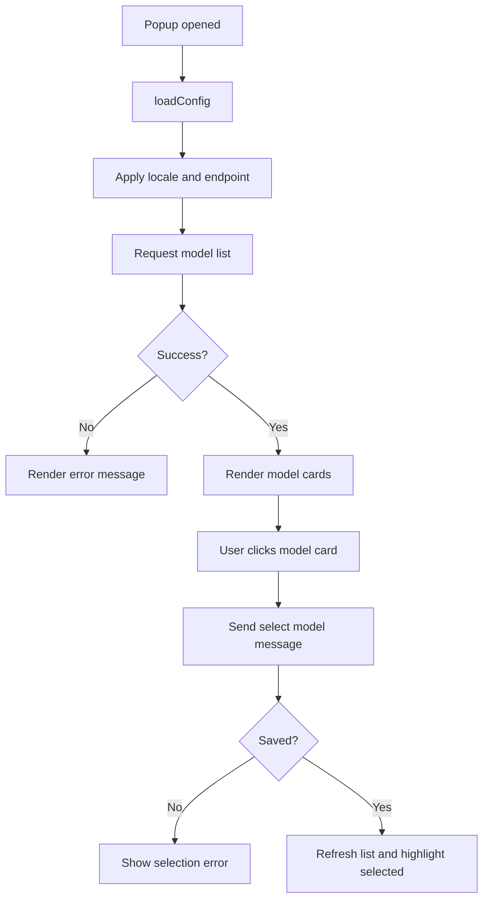

# Popup Model Selection

## 功能目的

Popup 是最輕量的控制入口，負責三件事：

- 顯示目前連到哪個 endpoint
- 刷新可用模型
- 切換 `selectedModel`

它不是完整設定頁，也不是聊天介面。

## 對外行為契約

- 開 popup 時必須自動讀取 config
- popup UI 文案優先跟 `uiLanguage`，若未設定才 fallback 到 `replyLanguage`
- 必須顯示 endpoint 目前值，沒有設定時顯示 `Not configured` 類型文案
- 必須列出模型卡片
- 點模型卡片後要立即更新 selected 狀態
- popup 選到的 `selectedModel` 代表預設快速回答模型；starter 若有更重路由，屬於執行時覆寫，不應直接改掉 popup 的 selected 狀態
- in-page 聊天面板的模型下拉可提供 `Auto` 模式；`Auto` 不改動 popup 這裡的 `selectedModel` 卡片選取，而是代表執行時可依 starter route 覆寫
- `Auto` 的路由應以能力類型為主，例如 `quick`、`reasoning`、`vision`，不可把某一個模型家族寫死成產品規則

## UI 結構契約

```text
Popup
|- Panel
   |- Header
   |  |- Eyebrow
   |  |- Title
   |- Inline Row
   |  |- Endpoint label + value
   |  |- Settings button
   |- Models Section
      |- Section title
      |- Refresh button
      |- Status message
      |- Model cards grid
```

## Dummy UI

```text
+--------------------------------------------------+
| Local Copilot Route                              |
| Open Copilot                                     |
|                                                  |
| Endpoint                     [Settings]          |
| http://127.0.0.1:11434                           |
|                                                  |
| Models                         [Refresh]         |
| Found 4 model(s).                                |
|                                                  |
| [ gemma4:e2b              ]                      |
| [ Selected                ]                      |
|                                                  |
| [ qwen2.5-coder-7b        ]                      |
| [ Use in GitHub           ]                      |
+--------------------------------------------------+
```

## 視覺規格

- popup 寬度約 380px
- 使用 `src/ui.css` 的深色玻璃卡樣式
- `popup-panel` 比 settings panel 更緊湊，padding 約 20px
- 卡片 grid 需保持可掃讀，不可做成純文字 list

## 互動規則

- `Refresh` 重新向 background 取模型清單
- 點 `Settings` 開 options page
- 點模型卡：
  - 發送 `ollama:select-model`
  - 成功後刷新列表
  - 目前 model 顯示 `Selected`
  - 其他 model 顯示 `Use in GitHub` 類型文案

## 狀態與資料

- 輸入：
  - `ollamaUrl`
  - `uiLanguage`
  - `replyLanguage`
  - `selectedModel`
- 運行時：
  - `models[]`
  - `popupLocale`

## Flow Chart



## 驗收標準

- popup 一打開就能看見 endpoint 與模型區
- 沒有模型時要有狀態文字，不能空白
- 切模型後 UI 必須立即反映 selected 狀態
- 切換語言後 popup 文案也要跟著更新
