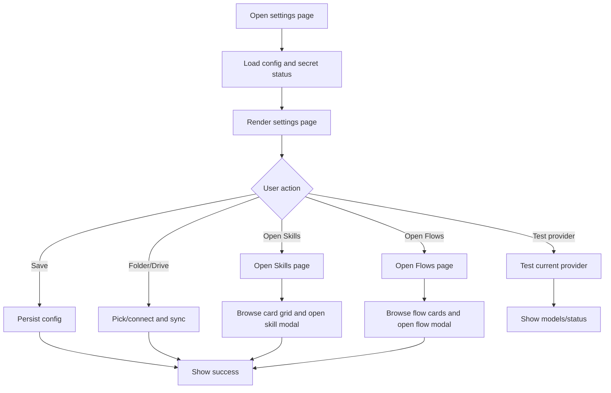

# Settings and Provider Config

## 功能目的

Settings 是整個產品的控制中樞，但不再把所有內容硬塞進同一個右側工作區。它負責：

- AI provider 設定
- 互動行為設定
- 本機資料夾與 Drive 同步
- GitHub token
- system prompt 與 multi-perspective profiles
- Skills Library 入口
- Agent Flows Library 入口

## 資訊架構原則

- `Settings` 只保留核心設定與管理入口
- `Skills` 必須是獨立完整頁面，不能只是 settings 內一個 tab
- `Flows` 必須是獨立完整頁面，不能只是 settings 內一個 tab
- 使用者在 settings 中可以看到 skills / flows 的摘要與入口，但主要管理動作在各自頁面完成
- skills / flows 的頁面空間必須以卡片瀏覽為主，不能退化成擁擠表格或窄欄列表

## 這頁不是單純設定表單

它同時是：

- provider control center
- experience control center
- local-first sync control panel
- skills / flows 管理入口頁

## UI 結構契約

```text
Settings Page
|- Backdrop grid
|- Main panel
   |- Hero header
   |- Toolbar
   |- Main layout
      |- Left/main provider card
      |  |- Provider tabs
      |  |- Provider panel content
      |  |- Shared support cards
      |- Right utility card
         |- Experience panel
         |- Skills library summary card
         |- Flows library summary card
|- Starter AI editor modal
```

## 主要畫面區塊

### 1. Hero Header

- 顯示產品名與說明
- 右上有 `Routing` / `Mode` 指標 pills

### 2. Toolbar

- Theme select
- `Test Connection`
- `Save Settings`

### 3. Provider Tabs

- `Ollama`
- `LM Studio`
- `Gemini`
- `Azure OpenAI`

### 4. Shared Support Cards

- Default provider
- Reply language
- Task extraction window
- GitHub API key
- Local work folder
- Google Drive sync

### 5. Experience and Library Entry Area

- `Experience` 保留在 settings 頁內直接編輯
- `Skills Library` 只顯示摘要、數量、最近狀態與進入按鈕
- `Flows Library` 只顯示摘要、數量、linked skills 統計與進入按鈕

## Dummy UI

```text
+--------------------------------------------------------------------------------+
| Open Copilot Settings                                                          |
| Configure providers and default browser chat experience                        |
| Routing: LOCAL    Mode: HYBRID                                  [Test] [Save] |
|                                                                                |
| [Ollama] [LM Studio] [Gemini] [Azure OpenAI]                                  |
|                                                                                |
| Ollama Control                                                                 |
| Ollama URL                                                                     |
| [ http://127.0.0.1:11434                                      ] [Refresh]      |
| Installed Models: [gemma4] [qwen2.5] [llama3.2]                               |
|                                                                                |
| Default Provider [ollama v]    Reply Language [zh-TW v]                       |
| Task Window [3 days v]                                                         |
| Starter Routing [on]  Quick [gemma4:e2b]  Deep [gemma4:e4b]  Vision [qwen-vl]|
|                                                                                |
| GitHub API Key [ ************************ ]                                    |
|                                                                                |
| Local Work Folder [Choose] [Clear] [Pull] [Push]                              |
| Google Drive Sync [Connect] [Pull] [Push] [Disconnect]                        |
|                                                                                |
| Experience                                                                     |
| [system prompt / profiles / hover tips]                                        |
|                                                                                |
| Skills Library                                               [Open Skills]     |
| 24 skills total / 12 built-in / 12 custom                                      |
|                                                                                |
| Agent Flows                                                  [Open Flows]      |
| 6 flows total / 18 linked skills                                               |
+--------------------------------------------------------------------------------+
```

## Skills Page 契約

### 頁面定位

- Skills 必須是獨立完整頁面
- 頁面寬度與密度可比 settings 更適合卡片瀏覽，不受 settings 側欄限制
- 這頁負責 skill 的瀏覽、匯入、編輯、AI 修改與刪除規則

### Skills Page UI 結構

```text
Skills Page
|- Hero header
|- Toolbar
|  |- Search
|  |- Filter tabs
|  |- Import button
|  |- Create button
|- Metrics row
|- Skills card grid
|  |- Skill card
|     |- Title
|     |- Type badge
|     |- Scope / mode badge
|     |- Short preview
|     |- Status / lock badge
|     |- Action row
|- Skill detail modal
|- Starter AI editor modal
```

### Skills 資料規則

- 預設內建 skill 必須全部列出
- custom skill 也必須列出
- 內建 skill 與 custom skill 要在同一套卡片系統中顯示
- 內建 skill 必須明確標示為 `Built-in`、`Default` 或等價 lock 狀態
- model routing 必須以能力角色配置為主，例如 `Quick model`、`Reasoning model`、`Vision model`；若未手動設定，才允許用已安裝模型名稱做 heuristic fallback
- 使用者不能刪除內建 skill
- 使用者可以複製內建 skill 作為新 custom skill
- 使用者可以編輯 custom skill
- 使用者可以刪除 custom skill

### Skills 卡片規則

- 每個 skill 都是一張卡片
- 卡片只顯示摘要，不直接塞入完整 prompt / instruction
- 卡片至少顯示：
  - skill 名稱
  - 一句 description 或 preview
  - mode / scope / tags
  - `Built-in` 或 `Custom` 狀態
  - 是否可刪除 / 可編輯
- 卡片點擊後才開啟 detail modal
- detail modal 內才顯示完整內容，例如完整 prompt、instruction、輸入輸出說明、適用場景

### Skill Detail Modal 契約

- 顯示完整 skill 內容
- 顯示完整 instruction / prompt
- 顯示 metadata，例如 id、scope、mode、來源
- built-in skill modal 中不可出現 `Delete`
- custom skill modal 中可出現 `Edit` / `Delete`
- built-in skill modal 建議提供 `Duplicate` 或 `Save as Custom`

## Agent Flows Page 契約

### 頁面定位

- Flows 必須是獨立完整頁面
- 這頁負責 flow 瀏覽、建立、排序、編輯步驟、刪除與 linked skills 檢視

### Flows Page UI 結構

```text
Flows Page
|- Hero header
|- Toolbar
|  |- Search
|  |- Create flow button
|- Metrics row
|- Flow card grid
|  |- Flow card
|     |- Name
|     |- Step count
|     |- Linked skills count
|     |- Short summary
|     |- Edit button
|- Flow detail modal
|- Flow editor modal
```

### Flow 卡片規則

- 每個 flow 都是一張卡片
- 卡片顯示 flow 名稱、步驟數、linked skills 數量與簡短 summary
- 點卡片後開 detail modal 檢視完整 flow steps
- 編輯仍在 flow editor modal 完成

## 樣式規格

- Settings 頁最大寬度約 1180px
- Skills / Flows 獨立頁可放寬到更適合卡片瀏覽的寬度
- 使用深色玻璃面板，背景有細格線 backdrop
- 卡片圓角大，視覺層次靠邊框、透明度、陰影建立
- tab 要像 capsule button，不可做成傳統 underline tabs
- Skills / Flows 卡片 grid 必須保留足夠間距，避免資訊擠壓

## DOM and Section Contract

- provider 主卡與 utility 側卡必須同時存在
- settings 頁不得再把 Skills / Flows 實作成右側 tab 內容
- settings 頁必須提供 `Open Skills` 與 `Open Flows` 類型的明確入口
- Skills / Flows 頁都必須使用卡片視圖作為主視圖
- Skills 頁要保留 metrics 區塊：
  - total count
  - built-in count
  - custom count
- Flows 頁要保留 metrics 區塊：
  - stored count
  - linked skills

## Provider 功能契約

### Ollama

- 可輸入 URL
- 可刷新已安裝模型
- 可顯示連線狀態

### LM Studio

- URL
- Default model ID
- API key

### Gemini

- Model
- API key

### Azure OpenAI

- Endpoint
- Deployment
- API version
- API key

## Experience 功能契約

- settings theme
- starter hover tips
- system prompt
- multi perspective profiles
- task extraction window

## Skills 管理契約

- 貼入 starter JSON
- 加入 library
- 清空 imported custom skills
- 預覽每個 skill card
- 檢視 skill detail modal
- custom skill 可刪除、可用 AI 修改
- built-in skill 不可刪除

## Agent Flows 管理契約

- 顯示已儲存 flow
- 顯示 linked skill 數量
- 可進入 flow editor
- 可調整步驟順序與刪除步驟
- 可從 detail modal 檢視完整 flow steps

## Modal 契約

### Starter AI Editor Modal

- 顯示目前 skill card
- 顯示與 AI 的對話紀錄
- 有 `Discuss With AI`
- 有 `Apply Update`

### Skill Detail Modal

- 顯示 skill 完整內容
- built-in skill 不可刪除
- custom skill 可編輯與刪除

### Flow Detail Modal

- 顯示 flow 名稱、summary、完整步驟
- 顯示每一步對應的 linked skill
- 可進入 flow editor

### Flow Editor Modal

- 可改 flow name
- 可檢視 flow steps
- 可把 custom skills 加入 flow
- 可儲存 flow

## Button Tone Contract

- `Save Settings` / `Apply Update` / `Save Flow` 使用 primary button
- `Open Skills` / `Open Flows` / `Edit` / `Duplicate` 使用 secondary button
- 清除、刪除使用 danger button，但仍維持整體冷色調產品氣質

## 狀態與資料

- `DEFAULT_CONFIG` 為主要設定基底
- secret fields 必須分開處理，不能直接回傳全部明文
- `customStarters` 為共享 library
- `builtInStarters` 必須作為唯讀資料來源單獨存在
- skills 頁展示資料 = `builtInStarters + customStarters`
- `multiPerspectiveProfiles` 為多行字串設定

## Flow Chart



## 驗收標準

- Settings 頁不可只有 provider form，必須包含 sync 與 library 入口
- Skills 與 Flows 必須是獨立完整頁面
- 預設 built-in skills 必須全部列出
- built-in skills 不可刪除
- 每個 skill 必須以卡片呈現
- 點 skill card 後才顯示完整內容
- custom starter library 與 agent flow library 必須維持可管理卡片視圖
- Drive / folder / GitHub token 必須在 settings 同頁可見
