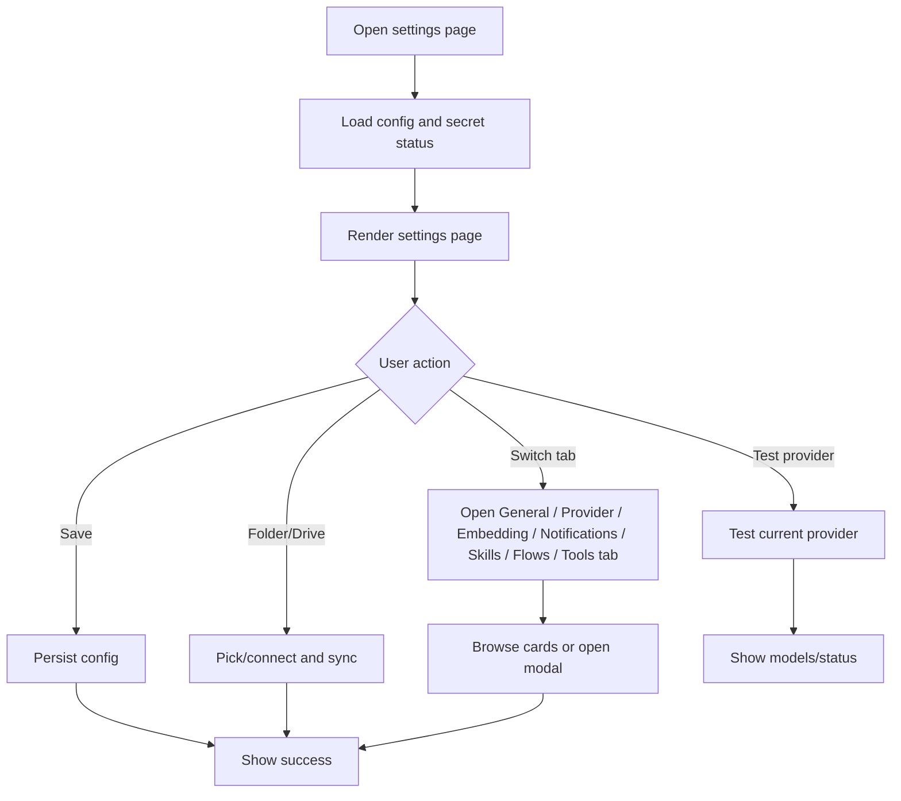

# Settings and Provider Config

## 功能目的

Settings 是整個產品的控制中樞，但不再把所有內容硬塞進同一個右側工作區。它負責：

- AI provider 設定
- 互動行為設定
- 本機資料夾與 Drive 同步
- GitHub token
- system prompt 與 multi-perspective profiles
- Skills Library 入口
- Agent Flows Library 入口
- Embedding provider 設定
- Built-in Tools 入口

## 資訊架構原則

- 目前實作以同一個 options page 承載所有設定與 library 管理。
- 最上層使用 tab 分成 `General`、`AI Provider`、`Embedding`、`Notifications`、`Skills`、`Flows`、`Tools`。
- `Skills` 與 `Flows` 雖然是 library 形態，但在現行版本中仍是 settings 內的完整分頁，不是獨立 URL。
- `Tools` 用來開啟 extension origin 下的內建工具頁，不是外部文件索引。
- 每個 tab 都維持卡片式瀏覽與大面積區塊，不能退化成擁擠表格或傳統後台表單。

## 這頁不是單純設定表單

它同時是：

- provider control center
- experience control center
- local-first sync control panel
- skills / flows 管理入口頁
- built-in tools launcher

## UI 結構契約

```text
Settings Page
|- Backdrop grid
|- Main panel
   |- Hero header
   |- Toolbar
   |- Top-level settings tabs
   |- General tab panel
   |  |- Experience card
   |  |- GitHub card
   |  |- Local work folder card
   |  |- Google Drive sync card
   |- AI Provider tab panel
   |  |- Default route card
   |  |- Provider card
   |  |  |- Provider tabs
   |  |  |- Provider status message
   |  |  |- Test connection button
   |  |  |- Provider panel content
   |  |  |- Starter routing card
   |- Embedding tab panel
   |  |- Default embedding provider card
   |  |- Embedding provider connection fields
   |- Notifications tab panel
   |  |- Telegram / LINE / Teams / Slack / Discord cards
   |- Skills tab panel
   |  |- Library hero + metrics
   |  |- JSON import/create area
   |  |- Starter cards grid
   |- Flows tab panel
   |  |- Flow templates
   |  |- Saved flow cards
   |  |- Batch URL QA logs entry
   |- Tools tab panel
   |  |- JSONL QA Editor card
   |  |- Knowledge Base QA Tester card
   |  |- RED Excel Agent Flow card
|- Starter AI editor modal
```

## 主要畫面區塊

### 1. Hero Header

- 顯示產品名與說明
- 右上有 `Routing` / `Mode` 指標 pills

### 2. Toolbar

- Theme select
- `Save Settings`

`Test Connection` 目前不在 global toolbar，而是在 `AI Provider` 分頁中的 provider card 內。

### 3. Provider Tabs

- `Ollama`
- `LM Studio`
- `Gemini`
- `Azure OpenAI`

### 4. General Tab

- UI language
- starter hover tips
- Teams inline action
- system prompt
- multi-perspective profiles
- GitHub API key
- local work folder
- Google Drive sync

### 5. AI Provider Tab

- default provider
- reply language
- task extraction window
- provider-specific connection fields
- provider connection test feedback
- starter model routing

### 6. Embedding Tab

- default embedding provider
- embedding model options for Ollama / LM Studio / Gemini / Azure OpenAI
- provider-specific embedding connection fields when needed
- KB / retrieval tools should use this default embedding route

### 7. Notifications Tab

- Telegram
- LINE
- Teams
- Slack
- Discord

每個通知卡片都要能：

- 開關 enable state
- 儲存 channel-specific credential
- 執行 test send
- 顯示結果訊息

### 8. Skills / Flows Tabs

- `Skills` tab 直接管理 built-in + custom starters
- `Flows` tab 直接管理 built-in flow templates + saved flows
- `Flows` tab 另外提供 Batch URL QA logs 入口

### 9. Tools Tab

- JSONL QA Editor
- Knowledge Base QA Tester
- RED Excel Agent Flow
- 工具頁以 extension origin 開新分頁，沿用 Open Copilot runtime 與 provider settings

## Dummy UI

```text
+--------------------------------------------------------------------------------+
| Open Copilot Settings                                                          |
| Configure providers and default browser chat experience                        |
| Routing: LOCAL    Mode: HYBRID                                         [Save] |
|                                                                                |
| [General] [AI Provider] [Embedding] [Notifications] [Skills] [Flows] [Tools] |
|                                                                                |
| General                                                                        |
| UI Language [zh-TW v]    Starter Hover Tips [on]    Teams Inline Action [on]  |
| System Prompt [............................................................]   |
| Multi-View Profiles [......................................................]   |
| GitHub API Key [ ************************ ]                                    |
| Local Work Folder [Choose] [Clear] [Pull] [Push]                              |
| Google Drive Sync [Connect] [Pull] [Push] [Disconnect]                        |
|                                                                                |
| AI Provider                                                                    |
| Default Provider [ollama v]    Reply Language [zh-TW v]   Task Window [3d v]  |
| [Ollama] [LM Studio] [Gemini] [Azure OpenAI]                                  |
| Provider Status: Ready                                          [Test]        |
| Starter Routing [on] Quick [selectedModel] Deep [reasoning] Vision [vision]   |
|                                                                                |
| Embedding                                                                      |
| Default Embedding Provider [ollama v]   Embedding Model [...]                 |
|                                                                                |
| Notifications                                                                  |
| [Telegram] [LINE] [Teams] [Slack] [Discord]                                   |
|                                                                                |
| Skills / Flows / Tools                                                         |
| Starter metrics + card grid / Flow templates + saved flows + Batch URL QA log |
| JSONL QA Editor / KB Tester / RED Excel Agent Flow                            |
+--------------------------------------------------------------------------------+
```

## Skills Tab 契約

### 分頁定位

- 這是一個 settings 內的完整 library tab，不是獨立頁。
- 負責 built-in 與 custom starter 的瀏覽、匯入、編輯、AI 修改與刪除規則。

### Skills Tab UI 結構

```text
Skills Tab
|- Hero header
|- Metrics row
|- Import / create intake row
|- Starter card grid
|- Skill detail modal
|- Starter AI editor modal
```

### Starter 資料規則

- 預設內建 skill 必須全部列出
- custom skill 也必須列出
- 內建 skill 與 custom skill 要在同一套卡片系統中顯示
- 內建 skill 必須明確標示為 `Built-in`、`Default` 或等價 lock 狀態
- model routing 必須以能力角色配置為主，例如 `Quick model`、`Reasoning model`、`Vision model`；若未手動設定，才允許用已安裝模型名稱做 heuristic fallback
- `Quick model` 目前對應 `selectedModel`，不是獨立持久化欄位
- 使用者不能刪除內建 skill
- 使用者可以隱藏部分 built-in skill
- 使用者可以複製內建 skill 作為新 custom skill
- 使用者可以編輯 custom skill
- 使用者可以刪除 custom skill

### Starter 卡片規則

- 每個 skill 都是一張卡片
- 卡片只顯示摘要，不直接塞入完整 prompt / instruction
- 卡片至少顯示：
  - skill 名稱
  - 一句 description 或 preview
  - mode / scope / tags
  - `Built-in` 或 `Custom` 狀態
  - 是否可刪除 / 可編輯
- 卡片點擊後才開啟 detail modal
- detail modal 內才顯示完整內容，例如完整 prompt、instruction、輸入輸出說明、適用場景

### Skill Detail Modal 契約

- 顯示完整 skill 內容
- 顯示完整 instruction / prompt
- 顯示 metadata，例如 id、scope、mode、來源
- built-in skill modal 中不可出現 `Delete`
- custom skill modal 中可出現 `Edit` / `Delete`
- built-in skill modal 建議提供 `Duplicate` 或 `Save as Custom`

## Flows Tab 契約

### 分頁定位

- 這是一個 settings 內的完整 library tab，不是獨立頁。
- 負責 flow template 檢視、saved flow 管理、linked skills 檢視與 Batch URL QA logs 入口。

### Flows Tab UI 結構

```text
Flows Tab
|- Hero header
|- Metrics row
|- Built-in Flow Templates
|- Saved Flow card grid
|- Batch URL QA Logs button
|- Flow detail modal
|- Flow editor modal
|- Batch URL QA Logs modal
```

### Flow 卡片規則

- 每個 flow 都是一張卡片
- 卡片顯示 flow 名稱、步驟數、linked skills 數量與簡短 summary
- 點卡片後開 detail modal 檢視完整 flow steps
- 編輯仍在 flow editor modal 完成

## 樣式規格

- Settings 頁最大寬度約 1180px
- 使用深色玻璃面板，背景有細格線 backdrop
- 卡片圓角大，視覺層次靠邊框、透明度、陰影建立
- tab 要像 capsule button，不可做成傳統 underline tabs
- Skills / Flows / Tools tab 內的卡片 grid 必須保留足夠間距，避免資訊擠壓

## DOM and Section Contract

- top-level settings tabs 必須存在
- provider tab 與 top-level settings tabs 是兩層不同導覽，不可合併
- `Skills` / `Flows` / `Tools` 必須以 settings 內完整 tab 形式存在
- `Skills` / `Flows` / `Tools` 都必須使用卡片視圖作為主視圖
- `Skills` tab 要保留 metrics 區塊：
  - total count
  - built-in count
  - custom count
- `Flows` tab 要保留 metrics 區塊：
  - stored count
  - linked skills
- `Notifications` tab 要保留五種通道卡片

## Provider 功能契約

### Ollama

- 可輸入 URL
- 可刷新已安裝模型
- 可顯示連線狀態

### LM Studio

- URL
- Default model ID
- API key

### Gemini

- Model
- API key

### Azure OpenAI

- Endpoint
- Deployment
- API version
- API key

## Experience 功能契約

- UI language
- settings theme
- starter hover tips
- Teams inline action
- system prompt
- multi perspective profiles
- task extraction window

## Skills 管理契約

- 貼入 starter JSON
- 加入 library
- 清空 imported custom skills
- 預覽每個 skill card
- 檢視 skill detail modal
- custom skill 可刪除、可用 AI 修改
- built-in skill 不可刪除

## Agent Flows 管理契約

- 顯示 built-in flow templates
- 顯示已儲存 flow
- 顯示 linked skill 數量
- 可進入 flow editor
- 可調整步驟順序與刪除步驟
- 可從 detail modal 檢視完整 flow steps
- 可查看 Batch URL QA logs

## Modal 契約

### Starter AI Editor Modal

- 顯示目前 skill card
- 顯示與 AI 的對話紀錄
- 有 `Discuss With AI`
- 有 `Apply Update`

### Skill Detail Modal

- 顯示 skill 完整內容
- built-in skill 不可刪除
- custom skill 可編輯與刪除

### Flow Detail Modal

- 顯示 flow 名稱、summary、完整步驟
- 顯示每一步對應的 linked skill
- 可進入 flow editor

### Flow Editor Modal

- 可改 flow name
- 可檢視 flow steps
- 可把 custom skills 加入 flow
- 可儲存 flow

## Button Tone Contract

- `Save Settings` / `Apply Update` / `Save Flow` 使用 primary button
- `Test Connection` / `Logs` / `Edit` / `Duplicate` 使用 secondary button
- 清除、刪除使用 danger button，但仍維持整體冷色調產品氣質

## 狀態與資料

- `DEFAULT_CONFIG` 為主要設定基底
- secret fields 必須分開處理，不能直接回傳全部明文
- `customStarters` 為共享 library
- `builtInStarters` 必須作為唯讀資料來源單獨存在
- skills 頁展示資料 = `builtInStarters + customStarters`
- `multiPerspectiveProfiles` 為多行字串設定

## Flow Chart



## 驗收標準

- Settings 頁不可只有 provider form，必須包含 sync、notifications 與 library tabs
- 預設 built-in skills 必須全部列出
- built-in skills 不可刪除
- 每個 skill 必須以卡片呈現
- 點 skill card 後才顯示完整內容
- custom starter library 與 agent flow library 必須維持可管理卡片視圖
- Tools tab 必須提供 JSONL QA Editor、Knowledge Base QA Tester、RED Excel Agent Flow 入口
- Drive / folder / GitHub token 必須在 settings 同頁可見
