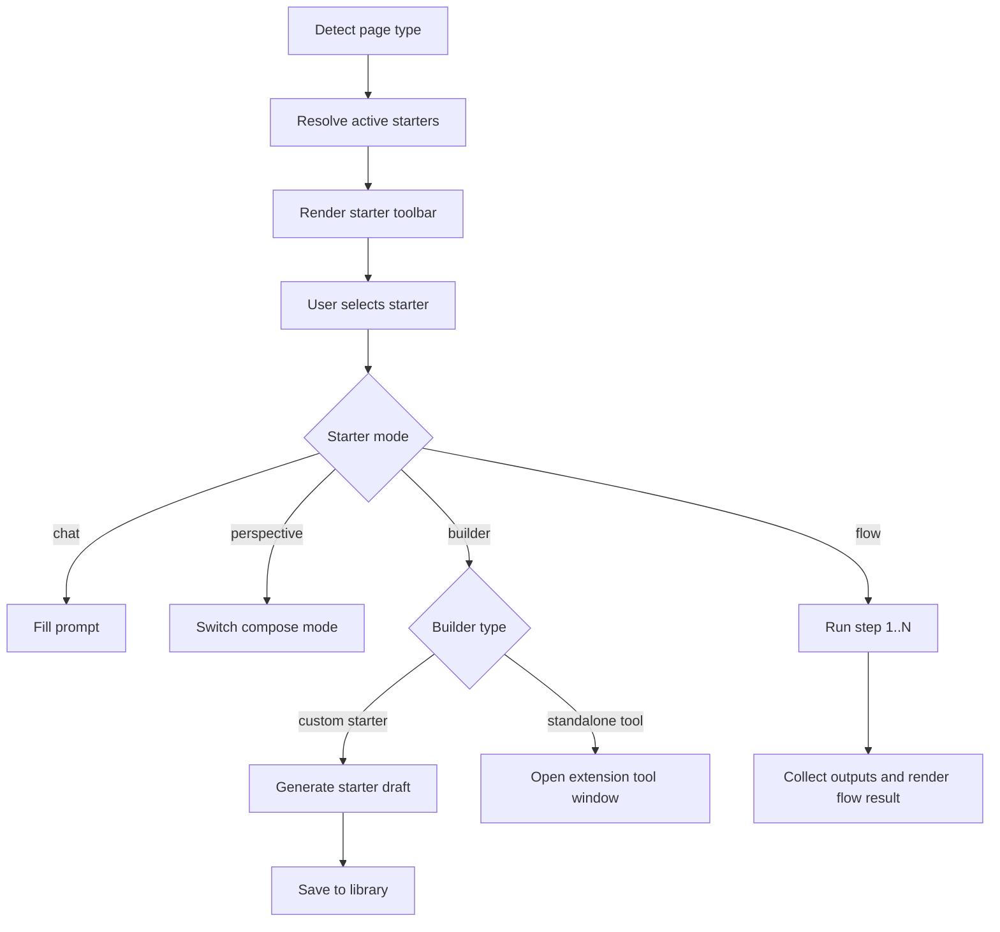

# Starters and Agent Flows

## 功能目的

Starters 是 Open Copilot 的核心，不是附屬快捷鍵。它們要減少 prompt friction，讓使用者直接從成熟工作流開始。

Agent Flows 則是把多個 starter 串成一條可重複執行的流程。

## 核心產品要求

- 依頁面類型調整 visible starters
- 不同 starter 可以切換不同 compose mode
- GitHub PR / diff / repo review 類 starter 可選擇自動切到更思考的模型
- image / screenshot / UX / UI / readability 類 starter 或附圖任務可選擇自動切到 vision 模型
- 自訂 starter 可從 settings 管理
- agent flow 可逐步跑完整流程
- 使用者可以用 AI 修改 starter

## Starter 類型

- Built-in starter
- Custom starter
- Custom starter builder
- Agent flow builder
- Agent flow
- Perspective starter

### Built-in Export Starters

- `landingHtml`
  - 輸出可直接開啟的單頁 HTML 簡報
- `landingPowerPoint`
  - 輸出 slide JSON，並由前端封裝成可下載的 `.pptx`
- `urlToSalesKitPptxFlow`
  - 收集一到多個 URL、受眾、語氣、語言與品牌風格，產生 sales kit `.pptx`
- `investmentProposalBuilder`
  - 開啟獨立 extension 視窗，產生台灣投資抵減附表6與附表7 `.docx`

## UI 契約

### In-page Starter Toolbar

- 位於側欄下方
- 小面板時可收合 / 展開
- 最大化時預設展開
- 按鈕採 pill / chip button 風格
- 推薦 starter 要有更高辨識度
- 若 starter 命中較重分析路由，點下去後要先顯示「使用更思考模型」提示，並提供「快速回答」切回預設模型

### Settings Starter Library

- 用卡片顯示 starter
- 卡片需顯示：
  - id
  - label
  - mode
  - scopes
  - prompt 摘要或 flow step 摘要

### Flow Editor

- 顯示 flow name
- 顯示現有步驟
- 顯示可加入的 custom skills

## Dummy UI

```text
In-page starters

+-------------------------------------------------------------------+
| Starter Tools                                                     |
| PageType: GitHub   Adapter: Repo                                  |
| [GitHub Summary] [Review Checklist] [Spec Coverage] [Test Gap]    |
| [Create Starter] [Create Agent Flow]                              |
+-------------------------------------------------------------------+

Settings library card

+-------------------------------------------------------------------+
| github-pr-review                                  [chat]          |
| scopes: github  code                                              |
| Review the current PR and list bugs, regressions, missing tests   |
| [Edit With AI] [Delete]                                           |
+-------------------------------------------------------------------+

Flow card

+-------------------------------------------------------------------+
| github-full-review                                [flow]          |
| scopes: github  code                                              |
| 1. Repo Summary -> 2. Spec Coverage -> 3. Test Gap               |
| [Edit Flow] [Delete]                                              |
+-------------------------------------------------------------------+
```

## Starter 契約

Starter 至少要支援：

- `id`
- `label`
- `prompt`
- `scopes`
- `mode`

### scope 作用

- 決定在哪些頁型或情境優先出現
- 例如：`github`, `code`, `article`, `document`, `generic`

### mode 作用

- `chat`：一般聊天填 prompt
- `perspective`：切到多視角模式
- `flow`：執行多步驟流程

## Agent Flow 契約

- 至少 2 步
- 每步都對應到一個 starter skill
- 可以把前一步輸出當下一步的主要輸入
- page context 與附件在 flow 中是輔助材料，不應無限制重灌

## Visual Differentiation Contract

- recommended starter：藍色強調
- custom starter builder：粉橘漸層強調
- agent flow / flow builder：綠色強調
- highlighted starter：外圈亮框和額外 glow

這些顏色差異是功能語意的一部分，不只是裝飾。

## AI 修改 Starter 契約

- 使用者輸入白話描述修改需求
- AI 先提出新的 skill 方案
- 使用者可按 `Apply Update`
- 不可直接跳過討論階段就默默覆寫

## Flow Chart



## 狀態與資料

- `customStarters[]`
- `highlightedStarterId`
- `areStartersExpanded`
- `composeMode`
- builder states:
  - `customStarterBuilderOpen`
  - `agentFlowBuilderOpen`

## Builder Contract

- custom starter builder 要能先對話，再產生 draft，再選擇儲存
- flow builder 要能維持 step draft 狀態，不可每次操作都重置整條 flow

## 驗收標準

- starters 必須是這個產品的一級體驗，不可藏太深
- settings 與 in-page panel 要共用同一份 starter library
- flow 需能明確看見步驟概念，不可偽裝成單次 prompt
