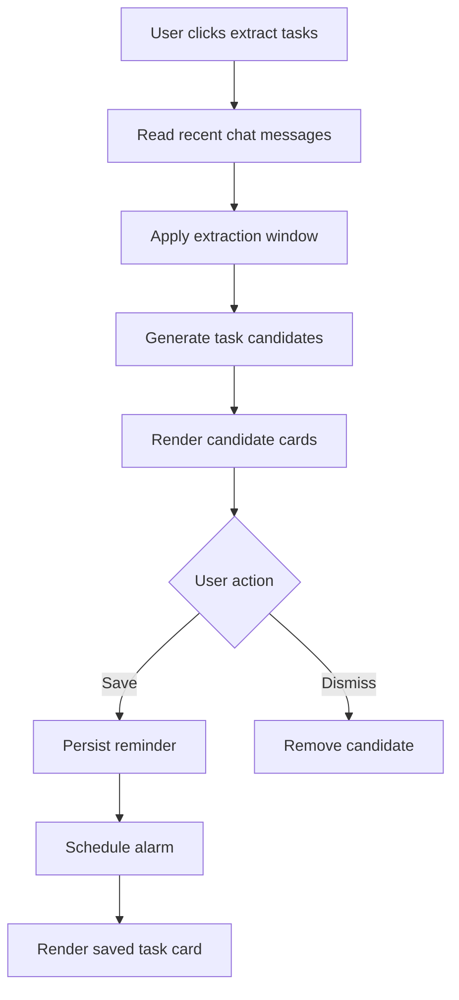

# Task Reminders

## 功能目的

把聊天中的 follow-up 轉成可以操作的 task candidates 與 saved reminders，讓產品從「回答工具」變成「工作收斂工具」。

## 核心契約

- 支援從聊天中抽 task candidates
- candidates 與 saved reminders 是兩層狀態
- reminder 可編輯日期、時間、狀態
- 已儲存 reminder 能被更新、完成、刪除

## UI 契約

```text
Task Inbox
|- Header
|- View tabs: candidates / saved
|- Candidate cards or saved cards
```

## Candidate Card 必要欄位

- title
- confidence chip
- summary
- owner
- due
- evidence
- reminder date
- reminder time
- save button
- dismiss button

## Saved Card 必要欄位

- title
- status chip
- summary
- owner
- due
- reminder date
- reminder time
- evidence
- update button
- done/reopen button
- delete button

## Dummy UI

```text
+------------------------------------------------------------------+
| Task Inbox (4)                                                   |
| [Candidates (2)] [Saved (2)]                                     |
|                                                                  |
| Candidate                                                        |
| Update export spec coverage                      [medium]         |
| Owner: unknown            Due: not set                           |
| Evidence: "spec 還不夠完善..."                                    |
| Reminder Date [2026-04-15]  Time [09:00]                         |
| [Save] [x]                                                       |
|                                                                  |
| Saved                                                            |
| Add regression test for HTML export             [open]           |
| Owner: Wilson             Due: Apr 16                            |
| Reminder Date [2026-04-16]  Time [10:00]                         |
| [Update] [Done] [x]                                              |
+------------------------------------------------------------------+
```

## 顯示規則

- 小面板內可作為嵌入式 task inbox
- 最大化且畫面夠寬時，要能成為獨立 task rail

## Visual Contract

- task card 是玻璃感資訊卡，不是 checklist 單行項目
- status / confidence 使用 chip
- meta 區要是雙欄資訊區塊
- reminder date/time 是直接可編輯欄位，不是純文字

## 資料流

1. 從可見對話取樣
2. 根據 extraction window 篩選近期內容
3. 送模型生成 candidates
4. 使用者手動儲存需要的 task
5. 儲存後進入 reminders storage
6. 若有提醒時間，註冊 alarm

## Flow Chart



## 狀態與資料

- `extractedTaskCandidates[]`
- `savedTaskReminders[]`
- `isExtractingTasks`
- `taskInboxExpanded`
- `taskInboxView`

## Alarm Contract

- 儲存有 reminderAt 的 task 後，需可對應到 background alarm
- 進入提醒時間前，系統應能準備 notification 流程

## 驗收標準

- candidate 與 saved 視圖要明確分開
- 每張卡都必須可直接操作 reminder date/time
- 最大化時 task rail 必須可獨立閱讀
