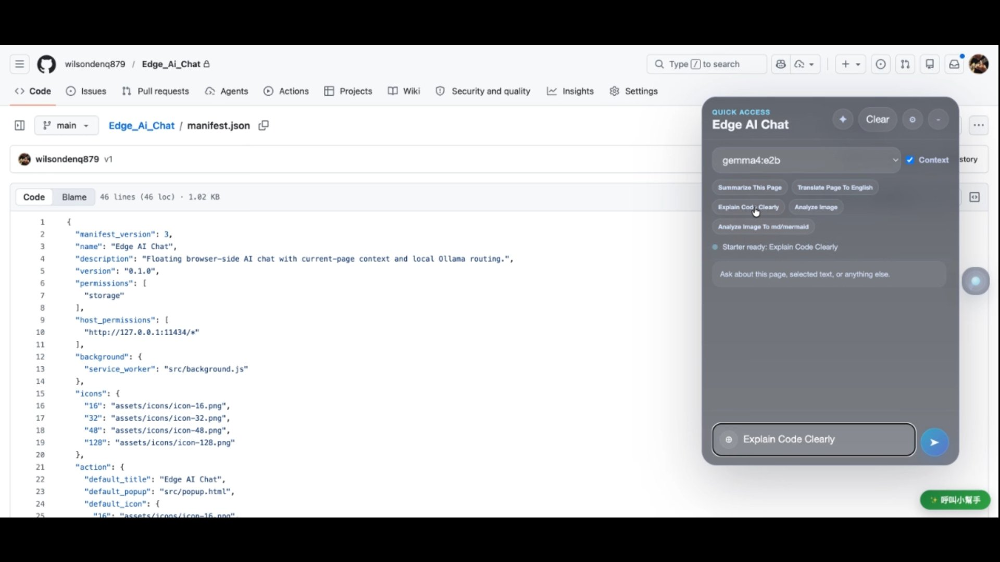
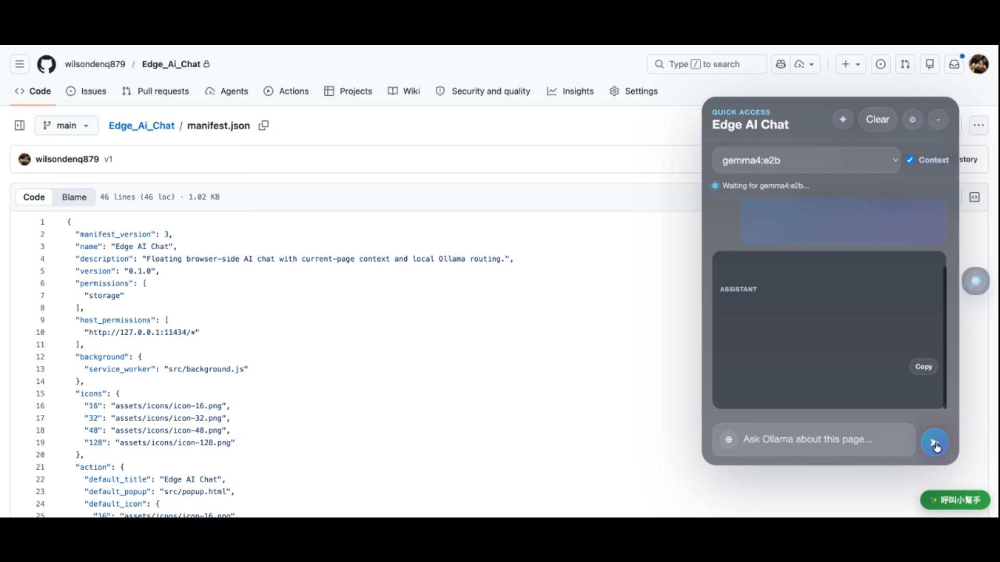

# Mastering Edge AI Chat: A Powerful Browser Extension for Enhanced Code Explanation

## What is edge ai chat?
Edge AI Chat is a specialized browser extension designed to integrate advanced Edge AI capabilities directly into your browsing experience. It acts as a powerful assistant that leverages sophisticated AI models to provide context-aware, in-depth explanations and analysis of complex information encountered online, particularly focusing on code and technical concepts. This tool moves beyond simple search results by analyzing the content of web pages in real-time, transforming passive reading into active learning. It is built to address the common challenge of needing immediate, clear understanding of complex technical documentation, programming snippets, or intricate system architectures without needing to switch to external documentation or search engines. The core value lies in its ability to distill complex information into easily digestible insights, significantly accelerating the learning process for developers, students, and technical professionals who spend significant time navigating technical content online. By embedding this AI functionality directly into the browser, Edge AI Chat provides a seamless, context-aware environment for deep technical comprehension, making complex topics accessible and actionable directly within the workflow.

## What are the benefits of edge ai chat?
* **Instant Code Clarity and Debugging**: This extension allows users to instantly analyze and explain complex code snippets found on any webpage. When faced with unfamiliar algorithms or tricky debugging scenarios, Edge AI Chat provides clear, contextual explanations, helping developers quickly grasp the logic and potential errors. This eliminates the need to manually search for external tutorials or documentation, drastically reducing the time spent on debugging and accelerating the development cycle. It transforms confusing lines of code into understandable concepts, enabling faster problem-solving and more efficient coding practices directly within the browser environment.
* **Deep Contextual Understanding of Technical Content**: Edge AI Chat excels at providing deep contextual understanding of technical articles, specifications, and system designs. Instead of merely summarizing text, it analyzes the surrounding context to provide explanations that are tailored to the specific technical context of the page. This ensures that the user receives explanations that are highly relevant and accurate, bridging the gap between raw information and true comprehension. It is invaluable for students and researchers who need to quickly assimilate complex technical knowledge from diverse online sources, ensuring that the information absorbed is accurate and contextually rich.
* **Streamlined Information Processing Workflow**: By integrating AI explanation directly into the browser, Edge AI Chat streamlines the information processing workflow. Users no longer need to constantly switch between reading the main content and searching for supplementary explanations. The ability to click commands directly on the page to trigger explanations means that complex analysis happens in-situ, keeping the user focused on the task at hand. This seamless integration reduces cognitive load and allows for a more fluid, uninterrupted flow of learning and development, making the process of technical research significantly more efficient and less frustrating.

## Setup Guide

### Step 1: Accessing the Edge AI Chat Feature
To begin using the tool, navigate to the desired webpage containing the code or technical content. Locate the 'Edge AI Chat' option within the browser interface. Clicking this initiates the AI analysis process, preparing the system to analyze the current context of the page for immediate explanation.

### Step 2: Requesting Clear Code Explanations
Once the AI is active, select the command to request a clear explanation, such as 'Explain Code Clearly'. This action prompts the AI to focus its analytical power specifically on the code presented on the screen, generating a detailed, easy-to-understand breakdown of the logic and functionality for the user.

### Step 3: Initiating the AI Interaction
Finally, use the designated trigger, represented by the '➤' symbol, to execute the request and view the generated explanation. This step finalizes the interaction, presenting the AI-generated insights directly on the screen, allowing the user to immediately absorb the complex information and proceed with their technical task.

## Conclusion
Edge AI Chat represents a significant leap forward in how technical information is consumed online. It transforms the passive act of reading into an active, interactive learning experience by embedding sophisticated AI analysis directly into the browser. For developers, students, and technical professionals, this extension offers an unparalleled tool for accelerating comprehension, debugging complex code, and mastering new concepts with unprecedented speed. The seamless integration into the browsing workflow eliminates the friction of context switching, allowing users to stay immersed in their work while gaining instant, deep insights. While it is not a replacement for deep, foundational study, Edge AI Chat serves as an indispensable accelerator, making complex technical knowledge immediately accessible and actionable, thereby significantly boosting overall productivity and learning efficiency in the digital age.
