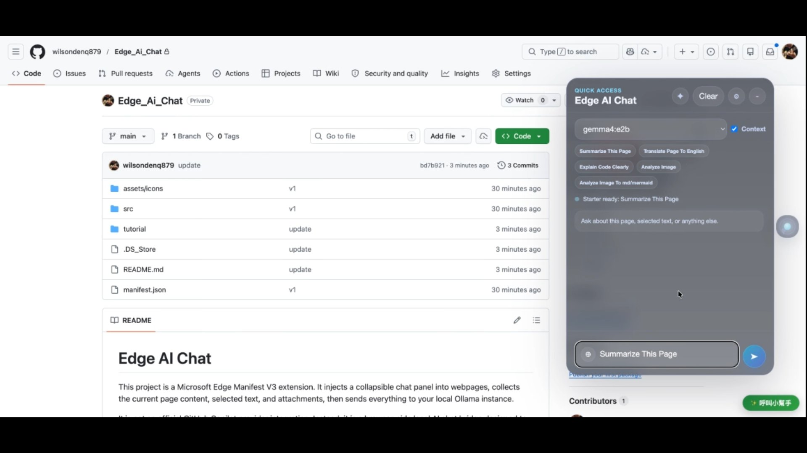
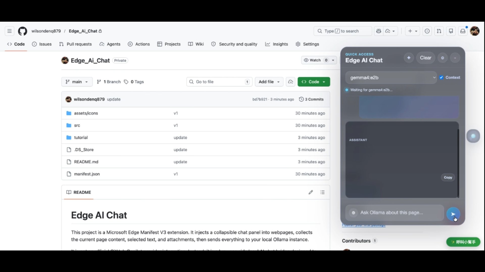

# Mastering Edge AI Chat and Page Summarization for Enhanced Workflow

## What is Edge AI chat?
Leveraging advanced AI capabilities directly at the edge allows users to perform complex tasks like real-time chat and intelligent summarization without relying on constant cloud connectivity. This capability transforms how information is processed and accessed, enabling immediate decision-making and content synthesis in dynamic environments. The core value lies in minimizing latency and maximizing operational autonomy. By integrating these features, users can interact with information and generate insights instantly, regardless of network conditions, making sophisticated AI tools accessible and highly responsive for demanding professional workflows. This approach shifts AI from a remote service to an integrated, on-device tool, significantly improving efficiency and responsiveness in scenarios where speed and local processing are paramount.

## What are the benefits of Edge AI chat?
* **Instant Edge AI Interaction**: The ability to click 'Edge AI chat' provides immediate access to sophisticated conversational AI directly on the device. This eliminates the delay associated with sending data to the cloud and waiting for a response, enabling seamless, real-time interaction with AI models for complex queries and brainstorming. This instant feedback loop is crucial for professionals who need to make quick decisions based on contextual information without interruption, significantly boosting workflow speed and reducing cognitive load associated with waiting for remote processing.
* **Intelligent Content Synthesis**: Utilizing the 'Summarize This Page' function allows users to instantly distill lengthy documents or web pages into concise, actionable summaries. This feature is invaluable for rapidly absorbing large amounts of information, saving significant time that would otherwise be spent manually reading and extracting key points. It transforms dense data into easily digestible insights, allowing users to focus on high-level strategy and analysis rather than tedious information processing, thereby enhancing overall productivity.
* **Streamlined Workflow Management**: The integrated sequence of actions, including initiating chat and summarizing content, creates a highly streamlined workflow. By consolidating these functions into a single interface, users can execute multi-step tasks with minimal navigation. This efficiency is particularly beneficial in fast-paced environments where time is a critical factor. The ability to move seamlessly between interacting with AI and synthesizing content ensures that complex tasks are handled efficiently, allowing professionals to maximize their time on high-value activities.

## Setup Guide

### Step 1: Initiate Edge AI Chat
Click 'Edge AI chat' to activate the on-device conversational AI. This action immediately engages the local AI model, preparing the system for real-time interaction. This step is the gateway to leveraging the AI's immediate processing power directly on the device, setting the stage for dynamic AI-driven conversations.

### Step 2: Summarize the Current Page
Click 'Summarize This Page' to instruct the system to analyze the current content and generate a concise summary. This process instantly processes the displayed information, extracting the most critical details and presenting them in an easily readable format. This feature is essential for quickly grasping the essence of complex documents without needing extensive manual review.

### Step 3: Execute Command Sequence
Click '➤' to execute the defined sequence of actions. This final step triggers the integrated workflow, seamlessly connecting the AI chat and summarization functions into a cohesive operation. This ensures that complex tasks are executed efficiently and cohesively, maximizing the utility of the on-device AI tools.

## Conclusion
The integration of Edge AI chat and intelligent summarization capabilities fundamentally redefines how users interact with information and manage workflows. By placing powerful AI functions directly at the edge, the system delivers unparalleled speed, autonomy, and efficiency. This setup is ideal for professionals, researchers, and anyone who demands instant, context-aware processing without compromising on data security or connectivity. The ability to perform complex tasks like real-time querying and content synthesis locally transforms the user experience from a passive consumption of data to an active, intelligent engagement with it. Ultimately, these features empower users to operate with greater speed and precision, making complex AI tools accessible and highly valuable in any demanding professional setting.
